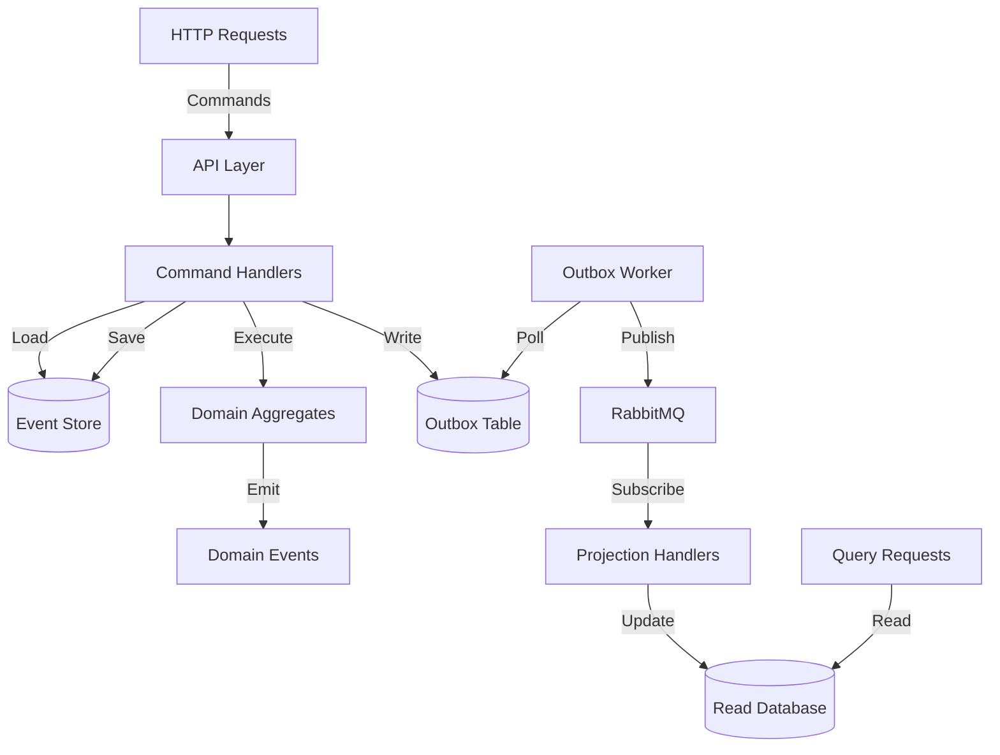
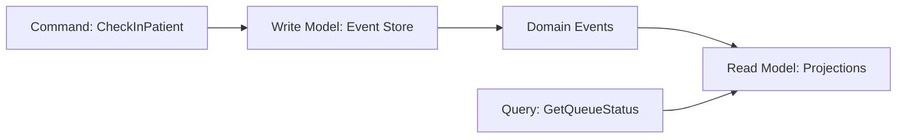

# 👋 Developer Onboarding Guide — RLAPP Backend

Welcome to the RLAPP Backend team! This guide will get you from zero to productive in **60 minutes**.

**Target audience:** New developers joining the project

**Prerequisites:**

- Basic .NET knowledge
- Familiarity with RESTful APIs
- Understanding of Docker basics

---

## 📋 Table of Contents

1. [Quick Start (15 minutes)](#quick-start)
2. [Architecture Overview (15 minutes)](#architecture-overview)
3. [Core Concepts (20 minutes)](#core-concepts)
4. [Development Workflow (10 minutes)](#development-workflow)
5. [Testing Strategy](#testing-strategy)
6. [Troubleshooting](#troubleshooting)
7. [Resources](#resources)

---

## 🚀 Quick Start

### Step 1: Environment Setup (5 minutes)

#### Prerequisites Installation

```bash
# 1. Install .NET 10 SDK
# Windows: Download from https://dot.net
# macOS: brew install dotnet
# Linux: See https://learn.microsoft.com/dotnet/core/install/linux

dotnet --version  # Should return 10.x.x

# 2. Verify Docker is installed
docker --version
docker-compose --version

# 3. Clone repository
git clone <repository-url>
cd rlapp-backend
```

### Step 2: Start Infrastructure (5 minutes)

```bash
# Start PostgreSQL, RabbitMQ, Prometheus, Grafana
docker-compose up -d

# Verify all services are healthy
docker-compose ps

# Expected output:
# postgres     Up (healthy)
# rabbitmq     Up (healthy)
# prometheus   Up
# grafana      Up
```

**Service URLs:**

- PostgreSQL: `localhost:5432` (user: `admin`, password: `admin123`)
- RabbitMQ Management: <http://localhost:15672> (user: `guest`, password: `guest`)
- Prometheus: <http://localhost:9090>
- Grafana: <http://localhost:3000> (user: `admin`, password: `admin`)

### Step 3: Build and Test (5 minutes)

```bash
# Restore dependencies
dotnet restore

# Build entire solution
dotnet build

# Expected: ✅ Build succeeded. 0 Error(s)

# Run all tests
bash run-complete-test.sh

# Expected: ✅ 75 tests passed (49 Domain, 7 Application, 15 Projections, 4 Integration)
```

### Step 4: Run the Application (2 minutes)

```bash
# Terminal 1: Start API
cd src/Services/WaitingRoom/WaitingRoom.API
dotnet run

# Terminal 2: Start Worker
cd src/Services/WaitingRoom/WaitingRoom.Worker
dotnet run

# Verify API is running
curl http://localhost:5000/health
# Expected: {"status":"Healthy"}
```

---

## 🏗️ Architecture Overview

### Architectural Pattern: Hexagonal + Event Sourcing + CQRS



### Layers Explained

| Layer | Responsibility | Dependencies | Example |
|-------|---------------|--------------|---------|
| **Domain** | Business logic, aggregates, rules | None (or BuildingBlocks) | `WaitingQueue.CheckInPatient()` |
| **Application** | Orchestration, use cases | Domain + Ports (interfaces) | `CheckInPatientCommandHandler` |
| **Infrastructure** | Concrete implementations | External libraries (Npgsql, RabbitMQ) | `PostgresEventStore` |
| **API** | HTTP endpoints, controllers | Application + Infrastructure | `CheckInPatientEndpoint` |

**Key Rule:** Domain NEVER depends on Infrastructure.

---

## 📚 Core Concepts

### Concept 1: Event Sourcing

**What:** Store all changes as a sequence of immutable events, not current state.

**Example:**

```csharp
// Traditional (State-based)
UPDATE waiting_queues SET patient_count = 5 WHERE queue_id = 'Q1'

// Event Sourcing
INSERT INTO event_store (aggregate_id, event_type, event_data)
VALUES ('Q1', 'PatientCheckedIn', '{"patientId": "P5", ...}')

// Reconstruct state by replaying events
State = Event1 → Event2 → Event3 → Event4 → Event5
```

**Why:**

- ✅ Complete audit trail (who did what, when)
- ✅ Time travel (state at any point in time)
- ✅ Event replay (rebuild projections)
- ✅ Debugging (see exact sequence of events)

**Read more:** [ADR-004: Event Sourcing](.ai/ADR-004-EVENT_SOURCING.md)

---

### Concept 2: CQRS (Command Query Responsibility Segregation)

**What:** Separate write model (commands) from read model (queries).



**Write Model:**

- Complex validation
- Business rules
- Transactional
- Event Store storage

**Read Model:**

- Denormalized views
- Optimized for queries
- Eventual consistency
- PostgreSQL views

**Example:**

```csharp
// WRITE: Command (mutates state)
var command = new CheckInPatientCommand
{
    QueueId = "Q1",
    PatientId = "P1",
    PatientName = "John Doe"
};
await _commandHandler.HandleAsync(command);

// READ: Query (no side effects)
var query = new GetQueueStatusQuery { QueueId = "Q1" };
var status = await _queryHandler.HandleAsync(query);
// status: { QueueId: "Q1", PatientCount: 5, Patients: [...] }
```

**Read more:** [ADR-005: CQRS](.ai/ADR-005-CQRS.md)

---

### Concept 3: Outbox Pattern

**What:** Guarantee event delivery even if message broker fails.

**Problem:**

```csharp
// ❌ BAD: Dual-write problem
await _eventStore.SaveAsync(aggregate);  // ✅ Success
await _messageBroker.PublishAsync(@event); // ❌ Fails (network down)
// Result: Event saved but never published → projections never updated
```

**Solution:**

```csharp
// ✅ GOOD: Outbox pattern
using var transaction = await _connection.BeginTransactionAsync();

// 1. Save event to Event Store
await SaveToEventStore(@event, transaction);

// 2. Write to Outbox (SAME transaction)
await WriteToOutbox(@event, transaction);

await transaction.CommitAsync();  // Atomic!

// 3. Background worker publishes from Outbox
// If RabbitMQ is down, events stay in Outbox until it's back
```

**Read more:** [ADR-006: Outbox Pattern](.ai/ADR-006-OUTBOX_PATTERN.md)

---

### Concept 4: Hexagonal Architecture

**What:** Domain at the center, infrastructure at the edges. Infrastructure depends on domain, never the opposite.

```
         ┌─────────────────────┐
         │   Infrastructure    │  (Adapters)
         │  PostgreSQL, RabbitMQ
         └─────────┬───────────┘
                   │ Implements
         ┌─────────▼───────────┐
         │       Ports         │  (Interfaces)
         │  IEventStore        │
         │  IEventPublisher    │
         └─────────┬───────────┘
                   │ Used by
         ┌─────────▼───────────┐
         │      Domain         │  (Core)
         │   Business Logic    │
         │  NO external deps   │
         └─────────────────────┘
```

**Key Benefit:** Domain is testable without infrastructure (no DB, no RabbitMQ).

**Read more:** [ADR-007: Hexagonal Architecture](.ai/ADR-007-HEXAGONAL_ARCHITECTURE.md)

---

## 🔨 Development Workflow

### Adding a New Feature: Complete Example

**Feature Request:** Add "Remove Patient" functionality.

#### Step 1: Domain (Business Logic)

```csharp
// File: src/Services/WaitingRoom/WaitingRoom.Domain/Aggregates/WaitingQueue.cs

public void RemovePatient(string patientId, string actor)
{
    // Validate business rules
    var patient = _patients.FirstOrDefault(p => p.PatientId == patientId);
    if (patient == null)
        throw new DomainException($"Patient {patientId} not found");

    // Emit domain event
    Apply(new PatientRemoved
    {
        QueueId = Id,
        PatientId = patientId,
        RemovedAt = DateTime.UtcNow,
        RemovedBy = actor
    });
}

// Event handler (rehydration)
private void When(PatientRemoved @event)
{
    _patients.RemoveAll(p => p.PatientId == @event.PatientId);
}
```

#### Step 2: Domain Event

```csharp
// File: src/Services/WaitingRoom/WaitingRoom.Domain/Events/PatientRemoved.cs

public sealed record PatientRemoved : DomainEvent
{
    public string QueueId { get; init; }
    public string PatientId { get; init; }
    public DateTime RemovedAt { get; init; }
    public string RemovedBy { get; init; }
}
```

#### Step 3: Command + Handler (Application)

```csharp
// File: src/Services/WaitingRoom/WaitingRoom.Application/Commands/RemovePatientCommand.cs

public sealed record RemovePatientCommand
{
    public string QueueId { get; init; }
    public string PatientId { get; init; }
    public string Actor { get; init; }
}

// File: src/Services/WaitingRoom/WaitingRoom.Application/CommandHandlers/RemovePatientCommandHandler.cs

public sealed class RemovePatientCommandHandler
{
    private readonly IEventStore _eventStore;

    public async Task<int> HandleAsync(RemovePatientCommand command)
    {
        // 1. Load aggregate
        var queue = await _eventStore.LoadAsync<WaitingQueue>(command.QueueId);

        // 2. Execute business logic
        queue.RemovePatient(command.PatientId, command.Actor);

        // 3. Save events (+ Outbox)
        await _eventStore.SaveAsync(queue);

        return queue.UncommittedEvents.Count;
    }
}
```

#### Step 4: API Endpoint

```csharp
// File: src/Services/WaitingRoom/WaitingRoom.API/Endpoints/RemovePatientEndpoint.cs

app.MapDelete("/api/waiting-room/{queueId}/patients/{patientId}",
    async (string queueId, string patientId, [FromBody] RemoveRequest request,
           RemovePatientCommandHandler handler) =>
{
    var command = new RemovePatientCommand
    {
        QueueId = queueId,
        PatientId = patientId,
        Actor = request.Actor
    };

    var eventCount = await handler.HandleAsync(command);

    return Results.Ok(new { success = true, eventCount });
});
```

#### Step 5: Projection Handler

```csharp
// File: src/Services/WaitingRoom/WaitingRoom.Projections/Handlers/PatientRemovedHandler.cs

public sealed class PatientRemovedHandler : IEventHandler<PatientRemoved>
{
    private readonly IWaitingRoomProjectionContext _context;

    public async Task HandleAsync(PatientRemoved @event)
    {
        // Update read model (eventual consistency)
        await _context.RemovePatientFromQueueAsync(@event.QueueId, @event.PatientId);
    }
}
```

#### Step 6: Tests

```csharp
// Domain Test
[Fact]
public void RemovePatient_Should_Emit_PatientRemoved_Event()
{
    var queue = WaitingQueue.Create(/* ... */);
    queue.CheckInPatient(/* ... */);

    queue.RemovePatient("P1", "nurse-001");

    var removedEvent = queue.UncommittedEvents.OfType<PatientRemoved>().Single();
    Assert.Equal("P1", removedEvent.PatientId);
}

// Application Test
[Fact]
public async Task HandleAsync_Should_SaveEvents()
{
    var fakeEventStore = new FakeEventStore();
    var handler = new RemovePatientCommandHandler(fakeEventStore);

    var eventCount = await handler.HandleAsync(command);

    Assert.Equal(1, eventCount);
    Assert.Single(fakeEventStore.SavedAggregates);
}
```

---

## 🧪 Testing Strategy

### Test Pyramid

```
           ┌────────┐
           │  E2E   │  4 tests (full pipeline)
           └────────┘
          ┌──────────┐
          │Integration│ 15 tests (projections)
          └──────────┘
        ┌──────────────┐
        │  Application  │ 7 tests (handlers with fakes)
        └──────────────┘
      ┌──────────────────┐
      │      Domain       │ 49 tests (pure unit tests)
      └──────────────────┘
```

### Running Tests

```bash
# Domain (fast, no dependencies)
dotnet test src/Tests/WaitingRoom.Tests.Domain

# Application (fakes, in-memory)
dotnet test src/Tests/WaitingRoom.Tests.Application

# Projections (in-memory or DB)
dotnet test src/Tests/WaitingRoom.Tests.Projections

# Integration (requires Docker)
docker-compose up -d
dotnet test src/Tests/WaitingRoom.Tests.Integration

# All tests
bash run-complete-test.sh
```

### Writing a Good Test

```csharp
[Fact]
public void CheckInPatient_When_QueueFull_Should_Throw_DomainException()
{
    // Arrange (Given)
    var queue = WaitingQueue.Create(maxCapacity: 2);
    queue.CheckInPatient(/* patient 1 */);
    queue.CheckInPatient(/* patient 2 */);

    // Act (When)
    var exception = Assert.Throws<DomainException>(() =>
        queue.CheckInPatient(/* patient 3 */));

    // Assert (Then)
    Assert.Contains("Queue is full", exception.Message);
}
```

**Test Naming Convention:** `MethodName_When_Condition_Should_ExpectedBehavior`

---

## 🐛 Troubleshooting

### Problem: Tests failing with "Database does not exist"

**Solution:**

```bash
# Stop containers
docker-compose down

# Remove volumes
docker volume prune -f

# Start fresh
docker-compose up -d

# Wait 10 seconds for initialization
sleep 10

# Re-run tests
dotnet test
```

---

### Problem: RabbitMQ connection refused

**Solution:**

```bash
# Check RabbitMQ is running
docker-compose ps rabbitmq

# Restart RabbitMQ
docker-compose restart rabbitmq

# Check logs
docker-compose logs -f rabbitmq

# Access management UI
# http://localhost:15672 (guest/guest)
```

---

### Problem: Outbox not dispatching events

**Solution:**

```bash
# 1. Check Worker is running
ps aux | grep WaitingRoom.Worker

# 2. Check Outbox table
docker exec -it rlapp_postgres psql -U admin -d rlapp_waitingroom
SELECT * FROM outbox WHERE published = FALSE;

# 3. Check Worker logs
cd src/Services/WaitingRoom/WaitingRoom.Worker
dotnet run --verbosity detailed
```

---

### Problem: Projection lag too high

**Solution:**

```bash
# Check Grafana dashboard
# http://localhost:3000 → Event Processing Lag

# If lag > 100ms:
# 1. Reduce Outbox polling interval (appsettings.json)
# 2. Check RabbitMQ queue depth
# 3. Optimize projection queries
```

---

## 📚 Resources

### Must-Read Documents (Priority Order)

1. **[ARCHITECTURE.md](ARCHITECTURE.md)** — Overall architecture vision (15 min)
2. **[DOMAIN_OVERVIEW.md](DOMAIN_OVERVIEW.md)** — Business rules and entities (10 min)
3. **[ADR-004: Event Sourcing](.ai/ADR-004-EVENT_SOURCING.md)** — Why Event Sourcing (10 min)
4. **[ADR-005: CQRS](.ai/ADR-005-CQRS.md)** — Write/Read separation (10 min)
5. **[TESTING_GUIDE.md](TESTING_GUIDE.md)** — Testing philosophy (10 min)

### Reference Documents

- [ADR-006: Outbox Pattern](.ai/ADR-006-OUTBOX_PATTERN.md)
- [ADR-007: Hexagonal Architecture](.ai/ADR-007-HEXAGONAL_ARCHITECTURE.md)
- [ADR-008: No Snapshot Strategy](.ai/ADR-008-NO_SNAPSHOT_STRATEGY.md)
- [ADR-009: Event Schema Versioning](.ai/ADR-009-EVENT_SCHEMA_VERSIONING.md)
- [APPLICATION_FLOW.md](APPLICATION_FLOW.md) — Step-by-step flow
- [INFRASTRUCTURE.md](INFRASTRUCTURE.md) — Persistence details

### Audit Reports (Quality Metrics)

- [AUDIT_REPORT.md](AUDIT_REPORT.md) — FASE 0 (Emergency repair)
- [PHASE1_REPORT.md](PHASE1_REPORT.md) — FASE 1 (Build validation)
- [PHASE2_REPORT.md](PHASE2_REPORT.md) — FASE 2 (Architecture validation)

### External Resources

- **Event Sourcing:** <https://martinfowler.com/eaaDev/EventSourcing.html>
- **CQRS:** <https://martinfowler.com/bliki/CQRS.html>
- **Hexagonal Architecture:** <https://alistair.cockburn.us/hexagonal-architecture>
- **Domain-Driven Design:** Eric Evans - "Domain-Driven Design" (Blue Book)

---

## 🎯 Your First Task

**Goal:** Add a new endpoint to get total patients checked in today.

**Steps:**

1. Add query model: `GetTodayCheckInsQuery`
2. Add query handler: `GetTodayCheckInsQueryHandler`
3. Add API endpoint: `GET /api/stats/today`
4. Write tests
5. Create PR

**Estimated time:** 30 minutes

**Help:** Ask in #rlapp-backend Slack channel

---

## ✅ Onboarding Checklist

Before your first PR, ensure:

- [x] Environment set up (Docker, .NET 10)
- [x] All 75 tests passing locally
- [x] Read ARCHITECTURE.md
- [x] Read DOMAIN_OVERVIEW.md
- [x] Read ADR-004, ADR-005
- [x] Ran the application locally
- [x] Explored RabbitMQ Management UI
- [x] Checked Grafana dashboards
- [x] Completed "Your First Task" above

**Congratulations! You're ready to contribute. 🚀**

---

**Questions?** Ask in #rlapp-backend or contact Architecture Team.

**Last updated:** 2026-02-19
