## Documento de referencia para equipo Frontend

---

## Tabla de Contenidos

1. Arquitectura General
2. Flujo de Ejecución Completo
3. Contratos de API (Detallado)
4. Patrones de Implementación Frontend
5. Guía de Estados y Transiciones
6. Matriz de Endpoints por Rol
7. Manejo de Errores
8. Casos de Uso Paso a Paso
9. Observabilidad y Debugging
10. Checklist de Implementación

---

## 1. Arquitectura General

### 1.1 Visión General

RLAPP es un sistema **event-driven** basado en:

- **Event Sourcing**: El estado se reconstruye desde eventos inmutables
- **CQRS**: Separación entre escritura (Commands) y lectura (Queries)
- **Outbox Pattern**: Garantía de entrega confiable de eventos

```
┌─────────────┐
│   Frontend  │
│  (Next.js)  │
└──────┬──────┘
       │
       ├─→ POST /api/[role]/* (Commands - Write)
       │   └─→ CommandHandler
       │       ├─→ Load Aggregate from EventStore
       │       ├─→ Apply business logic
       │       ├─→ Generate Domain Events
       │       └─→ Save to EventStore + Outbox (atomic)
       │
       └─→ GET /api/v1/waiting-room/* (Queries - Read)
           └─→ IWaitingRoomProjectionContext
               └─→ In-memory Read Models (eventually consistent)
```

### 1.2 Capas Arquitectónicas

```
┌───────────────────────────────────────────────────────┐
│              Presentation (API Layer)                 │
│  • Endpoints HTTP (Minimal APIs)                      │
│  • CorrelationId Middleware                           │
│  • ExceptionHandler Middleware                        │
│  • DTO Mapping                                        │
└──────────────────────┬────────────────────────────────┘
                       │
┌──────────────────────▼────────────────────────────────┐
│            Application (Use Cases)                    │
│  • CommandHandlers (CheckInPatient, etc.)            │
│  • DTOs (Data Transfer Objects)                       │
│  • Ports (IEventStore, IEventPublisher, IClock)      │
└──────────────────────┬────────────────────────────────┘
                       │
┌──────────────────────▼────────────────────────────────┐
│              Domain (Business Logic)                  │
│  • Aggregates (WaitingQueue)                          │
│  • Domain Events (PatientCheckedIn, etc.)            │
│  • Value Objects (Priority, ConsultationType)        │
│  • Invariants & Rules                                 │
└──────────────────────┬────────────────────────────────┘
                       │
┌──────────────────────▼────────────────────────────────┐
│          Infrastructure (Persistence)                 │
│  • PostgreSQL EventStore                              │
│  • Outbox Table                                       │
│  • RabbitMQ Publisher                                 │
│  • Projection Engine                                  │
└───────────────────────────────────────────────────────┘
```

### 1.3 Flujo de Datos

```
Command Request
    ↓
[CorrelationIdMiddleware] → Genera/extrae traceId
    ↓
[Endpoint] → Mapea DTO → Command
    ↓
[CommandHandler]
    ├─ LoadAsync(aggregateId) → Reconstruye desde eventos
    ├─ aggregate.DoSomething(command) → Lógica de dominio
    ├─ SaveAsync(aggregate) → EventStore + Outbox transacción
    └─ Retorna eventCount
    ↓
[Response] → 200 {success, eventCount, correlationId}
    ↓
[OutboxWorker] (Background) → Lee Outbox → Publica RabbitMQ
    ↓
[ProjectionEngine] (Background) → Consume eventos → Actualiza Read Models
    ↓
[Query Endpoint] → Lee desde Read Models → Responde proyecciones
```

---

## 2. Flujo de Ejecución Completo

### 2.1 Caso: Check-In de Paciente (Reception/Register)

#### Phase 1: Request (Frontend → Backend)

**Request:**

```bash
POST /api/reception/register
X-Correlation-Id: f47ac10b-58cc-4372-a567-0e02b2c3d479
Content-Type: application/json

{
  "queueId": "QUEUE-01",
  "patientId": "PAT-001",
  "patientName": "Juan Pérez",
  "priority": "High",
  "consultationType": "General",
  "age": 68,
  "isPregnant": false,
  "notes": "Dolor torácico",
  "actor": "reception-01"
}
```

#### Phase 2: Middleware Processing

```csharp
// CorrelationIdMiddleware.cs
1. Extract X-Correlation-Id header OR generate new UUID
2. Store in HttpContext.Items["CorrelationId"]
3. Make available to all downstream handlers
4. Will be returned in response header
```

#### Phase 3: Endpoint Handler

```csharp
// Program.cs endpoint
app.MapPost("/api/reception/register", async (
    CheckInPatientDto dto,                    // ✓ Auto-bound from JSON
    HttpContext httpContext,                  // ✓ Injected by ASP.NET
    CheckInPatientCommandHandler handler,     // ✓ From DI container
    ILogger<Program> logger,
    CancellationToken ct) =>
{
    // Extract correlationId
    var correlationId = httpContext.Items["CorrelationId"]?.ToString()
        ?? Guid.NewGuid().ToString();

    // Map DTO → Command
    var command = new CheckInPatientCommand
    {
        QueueId = dto.QueueId,
        PatientId = dto.PatientId,
        PatientName = dto.PatientName,
        Priority = dto.Priority,
        ConsultationType = dto.ConsultationType,
        Notes = dto.Notes,
        Actor = dto.Actor,
        CorrelationId = correlationId  // ← Propagate for tracing
    };

    // Delegate to handler
    var eventCount = await handler.HandleAsync(command, ct);

    // Return success
    return Results.Ok(new
    {
        success = true,
        message = "Patient registered successfully",
        correlationId = correlationId,
        eventCount = eventCount,
        patientId = dto.PatientId
    });
});
```

#### Phase 4: Application Layer (Handler)

```csharp
// CheckInPatientCommandHandler.cs
public class CheckInPatientCommandHandler
{
    private readonly IEventStore _eventStore;
    private readonly IClock _clock;

    public async Task<int> HandleAsync(
        CheckInPatientCommand command,
        CancellationToken ct)
    {
        // 4A: Load Aggregate from EventStore
        var queue = await _eventStore.LoadAsync(command.QueueId, ct);

        if (queue == null)
            throw new AggregateNotFoundException(
                $"Queue {command.QueueId} not found");

        // 4B: Create metadata for audit
        var metadata = EventMetadata.CreateNew(
            aggregateId: command.QueueId,
            actor: command.Actor,
            correlationId: command.CorrelationId);

        // 4C: Create Value Objects (validation)
        var patientId = PatientId.Create(command.PatientId);
        var priority = Priority.Create(command.Priority);
        var consultationType = ConsultationType.Create(
            command.ConsultationType);

        // 4D: Execute domain logic
        queue.CheckInPatient(
            patientId: patientId,
            patientName: command.PatientName,
            priority: priority,
            consultationType: consultationType,
            checkInTime: _clock.UtcNow,
            metadata: metadata,
            notes: command.Notes);

        // 4E: Persist atomically (EventStore + Outbox)
        await _eventStore.SaveAsync(queue, ct);

        // Return count of events generated
        return queue.UncommittedEvents.Count;
    }
}
```

#### Phase 5: Domain Layer (Aggregate Logic)

```csharp
// WaitingQueue.cs (Aggregate Root)
public void CheckInPatient(
    PatientId patientId,
    string patientName,
    Priority priority,
    ConsultationType consultationType,
    DateTime checkInTime,
    EventMetadata metadata,
    string notes)
{
    // Validate invariants
    WaitingQueueInvariants.ValidateCapacity(
        this.Patients.Count,
        this.MaxCapacity);
        // throws DomainException if queue is full

    WaitingQueueInvariants.ValidateDuplicate(
        patientId,
        this.Patients);
        // throws DomainException if patient already in queue

    // Create event
    var @event = new PatientCheckedInEvent(
        QueueId: this.Id,
        PatientId: patientId.Value,
        PatientName: patientName,
        Priority: priority.Value,
        ConsultationType: consultationType.Value,
        CheckInTime: checkInTime,
        Notes: notes,
        Metadata: metadata);

    // Apply event (updates internal state)
    ApplyEvent(@event);

    // Mark as uncommitted
    _uncommittedEvents.Add(@event);
}

private void ApplyEvent(PatientCheckedInEvent @event)
{
    var patient = new Patient(
        @event.PatientId,
        @event.PatientName,
        @event.Priority,
        @event.ConsultationType,
        @event.CheckInTime);

    this.Patients.Add(patient);
    this.Version++;
}
```

#### Phase 6: Persistence (EventStore)

```csharp
// PostgresEventStore.cs
public async Task SaveAsync(WaitingQueue aggregate, CancellationToken ct)
{
    using var tx = await _connection.BeginTransactionAsync(ct);

    try
    {
        // 6A: Save events to event_store table
        foreach (var @event in aggregate.UncommittedEvents)
        {
            var sql = @"
                INSERT INTO event_store
                (event_id, aggregate_id, aggregate_type, event_type, data,
                 version, correlation_id, causation_id, actor, occurred_at)
                VALUES (@eventId, @aggregateId, @aggregateType, @eventType,
                        @data, @version, @correlationId, @causationId,
                        @actor, @occurredAt)";

            await _connection.ExecuteAsync(sql, new
            {
                eventId = Guid.NewGuid(),
                aggregateId = aggregate.Id,
                aggregateType = nameof(WaitingQueue),
                eventType = @event.GetType().Name,
                data = JsonConvert.SerializeObject(@event),
                version = aggregate.Version,
                correlationId = @event.Metadata.CorrelationId,
                causationId = @event.Metadata.EventId,
                actor = @event.Metadata.Actor,
                occurredAt = @event.Metadata.OccurredAt
            }, transaction: tx);
        }

        // 6B: Save to Outbox for reliable publication
        foreach (var @event in aggregate.UncommittedEvents)
        {
            var outboxSql = @"
                INSERT INTO outbox
                (aggregate_id, event_type, event_data, created_at)
                VALUES (@aggregateId, @eventType, @eventData, @createdAt)";

            await _connection.ExecuteAsync(outboxSql, new
            {
                aggregateId = aggregate.Id,
                eventType = @event.GetType().Name,
                eventData = JsonConvert.SerializeObject(@event),
                createdAt = DateTime.UtcNow
            }, transaction: tx);
        }

        // 6C: Commit atomically
        await tx.CommitAsync(ct);

        // 6D: Clear uncommitted events
        aggregate.ClearUncommittedEvents();
    }
    catch
    {
        await tx.RollbackAsync(ct);
        throw;
    }
}
```

**Database state after save:**

```sql
-- event_store table
SELECT * FROM event_store WHERE aggregate_id = 'QUEUE-01';

id  | event_id                             | aggregate_id | event_type          | version | occurred_at
----|--------------------------------------|--------------|---------------------|---------|------------------
1   | f47ac10b-58cc-4372-a567-0e02b2c3d479| QUEUE-01     | QueueCreated        | 1       | 2026-02-19 10:00
2   | a87ac10b-58cc-4372-a567-0e02b2c3d480| QUEUE-01     | PatientCheckedIn    | 2       | 2026-02-19 10:05

-- outbox table
SELECT * FROM outbox WHERE processed_at IS NULL;

id | aggregate_id | event_type        | event_data                  | created_at | processed_at
---|--------------|-------------------|-----------------------------|------------|-------------
1  | QUEUE-01     | PatientCheckedIn  | {...PatientCheckedInEvent}  | 2026-02-19 | NULL
```

#### Phase 7: HTTP Response (Immediate)

```json
HTTP/1.1 200 OK
X-Correlation-Id: f47ac10b-58cc-4372-a567-0e02b2c3d479
Content-Type: application/json

{
  "success": true,
  "message": "Patient registered successfully",
  "correlationId": "f47ac10b-58cc-4372-a567-0e02b2c3d479",
  "eventCount": 1,
  "patientId": "PAT-001"
}
```

**⚠️ IMPORTANT:** Response arrives in **50-100ms** but projection might not be updated yet!

#### Phase 8: Background Processing (Async)

**8A: Outbox Worker reads events**

```csharp
// OutboxWorker (background service)
while (true)
{
    var unpublishedEvents = await _db.GetUnpublishedOutboxEventsAsync();

    foreach (var outboxEntry in unpublishedEvents)
    {
        // Deserialize
        var @event = JsonConvert.DeserializeObject(
            outboxEntry.EventData,
            Type.GetType(outboxEntry.EventType));

        // Publish to RabbitMQ
        await _eventPublisher.PublishAsync(@event);

        // Mark as processed
        await _db.MarkOutboxAsProcessedAsync(outboxEntry.Id);
    }

    // Wait before next poll
    await Task.Delay(TimeSpan.FromMilliseconds(500));
}
```

**8B: RabbitMQ routing**

```
Exchange: rlapp.events (topic)
Message:  PatientCheckedInEvent
Routing:  waiting-room.patient.checked-in

Subscribers:
  - WaitingRoomProjectionEngine (subscribes to waiting-room.*)
```

**8C: Projection Engine consumes & updates read models**

```csharp
// WaitingRoomProjectionEngine.cs
public async Task HandleAsync(PatientCheckedInEvent @event)
{
    // Load current projection
    var queueState = await _context.GetQueueStateAsync(@event.QueueId);

    if (queueState == null)
        queueState = new QueueStateView { QueueId = @event.QueueId };

    // Update read model
    queueState.CurrentCount++;
    queueState.PatientsInQueue.Add(new PatientInQueueDto
    {
        PatientId = @event.PatientId,
        PatientName = @event.PatientName,
        Priority = @event.Priority,
        CheckInTime = @event.CheckInTime,
        WaitTimeMinutes = 0
    });

    // Persist to in-memory context
    await _context.UpdateQueueStateAsync(queueState);

    // Mark projection as updated
    queueState.ProjectedAt = DateTime.UtcNow;
}
```

**Timing:**

- Command response: **50-100ms**
- Outbox worker pickup: **0-500ms**
- RabbitMQ publish: **5-20ms**
- Projection update: **10-50ms**
- **Total latency: 100-200ms** (usually much faster)

#### Phase 9: Frontend Reads Updated State

```bash
# Frontend polls after command confirms
GET /api/v1/waiting-room/QUEUE-01/queue-state

HTTP/1.1 200 OK
Content-Type: application/json

{
  "queueId": "QUEUE-01",
  "currentCount": 5,        // ← Updated!
  "maxCapacity": 50,
  "isAtCapacity": false,
  "availableSpots": 45,
  "patientsInQueue": [
    {
      "patientId": "PAT-001",
      "patientName": "Juan Pérez",
      "priority": "High",
      "checkInTime": "2026-02-19T10:05:00Z",
      "waitTimeMinutes": 0
    },
    // ... other patients
  ],
  "projectedAt": "2026-02-19T10:05:00.150Z"
}
```

---

## 3. Contratos de API (Detallado)

### 3.1 Convenciones Globales

#### Headers

**Obligatorios:**

```http
Content-Type: application/json
```

**Recomendados:**

```http
X-Correlation-Id: <uuid>  # Para trazabilidad distribuida
```

Si no se envía `X-Correlation-Id`, el backend lo genera automáticamente.

#### Respuesta de Éxito (Commands)

```json
{
  "success": true,
  "message": "Operation completed successfully",
  "correlationId": "f47ac10b-58cc-4372-a567-0e02b2c3d479",
  "eventCount": 1,
  "patientId": "PAT-001"  // ← Not always present
}
```

| Campo | Tipo | Descripción |
|-------|------|-------------|
| `success` | bool | Siempre `true` en 200 |
| `message` | string | Descripción operativa |
| `correlationId` | string UUID | Para debugging distribuido |
| `eventCount` | int | Número de eventos generados |
| `patientId` | string | ID del paciente (si aplica) |

#### Respuesta de Error (Global)

```json
{
  "error": "DomainViolation",
  "message": "Queue is at maximum capacity (50). Cannot add more patients.",
  "correlationId": "f47ac10b-58cc-4372-a567-0e02b2c3d479"
}
```

| Status | Error | Causa | Acción recomendada |
|--------|-------|-------|-------------------|
| **400** | `DomainViolation` | Regla de negocio violada | Mostrar mensaje al usuario |
| **400** | `ValidationError` | DTO inválido | Validar en frontend |
| **404** | `AggregateNotFound` | Agregado/cola no existe | Recargar contexto |
| **409** | `ConcurrencyConflict` | Edición simultánea | Refrescar + retry |
| **500** | `InternalServerError` | Error inesperado | Genérico + correlationId |

---

### 3.2 Endpoints por Rol

#### 🏥 RECEPCIÓN (Registration)

##### `POST /api/reception/register`

**Propósito:** Registrar paciente en cola, asignando prioridad automáticamente.

**Request:**

```json
{
  "queueId": "QUEUE-01",
  "patientId": "PAT-001",
  "patientName": "Juan Pérez",
  "priority": "High",
  "consultationType": "General",
  "age": 68,
  "isPregnant": false,
  "notes": "Dolor torácico",
  "actor": "reception-01"
}
```

**Validaciones:**

| Campo | Regla | Error |
|-------|------|-------|
| `queueId` | No vacío | 400: Queue required |
| `patientId` | No vacío | 400: PatientId required |
| `patientName` | No vacío | 400: PatientName required |
| `priority` | ∈ {Low, Medium, High, Urgent} | 400: Invalid priority |
| `consultationType` | 2 ≤ length ≤ 100 | 400: Invalid consultation type |
| `actor` | No vacío | 400: Actor required |
| Queue capacity | currentCount < maxCapacity | 400: Queue at capacity |
| Duplicate check | patientId ∉ queue.patients | 400: Duplicate patient |

**Success Response (200):**

```json
{
  "success": true,
  "message": "Patient registered successfully",
  "correlationId": "f47ac10b-58cc-4372-a567-0e02b2c3d479",
  "eventCount": 1,
  "patientId": "PAT-001"
}
```

**State Machine:**

```
(Initial)
   ↓
[CheckInPatient validated]
   ↓
PatientCheckedIn event
   ↓
Patient status: Registrado
```

**Frontend Flow:**

```typescript
// 1. Call command
const response = await api.post('/api/reception/register', {
  queueId: 'QUEUE-01',
  patientId: 'PAT-001',
  patientName: 'Juan Pérez',
  priority: 'High',
  consultationType: 'General',
  actor: 'reception-01'
});

// 2. Show success
toast.success(response.message);
correlationId = response.correlationId;  // Store for debugging

// 3. Invalidate & refetch
await invalidate(/queue-state/);
await invalidate(/monitor/);
```

---

#### 💳 TAQUILLA (Cashier)

##### `POST /api/cashier/call-next`

**Propósito:** Llamar siguiente paciente para pago, aplicando prioridad administrativa primero y FIFO dentro de nivel.

**Request:**

```json
{
  "queueId": "QUEUE-01",
  "actor": "cashier-01",
  "cashierDeskId": "DESK-01"
}
```

**Algoritmo de selección:**

```
FOR each patient in queue:
  IF status == Registrado:
    IF highPriority > 0:
      SELECT first(highPriority, FIFO)
    ELSE IF normalPriority > 0:
      SELECT first(normalPriority, FIFO)
    ELSE:
      SELECT first(lowPriority, FIFO)
```

**Success Response (200):**

```json
{
  "success": true,
  "message": "Next patient called to cashier",
  "correlationId": "...",
  "eventCount": 1,
  "patientId": "PAT-001"
}
```

**Error Cases:**

```
400: No patients waiting
  → No hay pacientes en estado Registrado

409: Concurrency conflict
  → Otro proceso modificó la cola simultáneamente
```

**State Machine:**

```
Registrado
   ↓
[call-next]
   ↓
PatientCalledAtCashier event
   ↓
Patient status: EnTaquilla
```

##### `POST /api/cashier/validate-payment`

**Propósito:** Validar pago y habilitar paso a cola de consulta.

**Request:**

```json
{
  "queueId": "QUEUE-01",
  "patientId": "PAT-001",
  "actor": "cashier-01",
  "paymentReference": "PAY-123456"
}
```

**Validaciones:**

- Patient exists and status == EnTaquilla
- paymentReference not empty

**Success Response (200):**

```json
{
  "success": true,
  "message": "Payment validated successfully",
  "correlationId": "...",
  "eventCount": 1,
  "patientId": "PAT-001"
}
```

**State Machine:**

```
EnTaquilla
   ↓
[validate-payment]
   ↓
PaymentValidated event
   ↓
Patient status: PagoValidado → EnEsperaConsulta
```

##### `POST /api/cashier/mark-payment-pending`

**Propósito:** Registrar intento fallido de pago (máximo 3 intentos).

**Request:**

```json
{
  "queueId": "QUEUE-01",
  "patientId": "PAT-001",
  "actor": "cashier-01",
  "reason": "Tarjeta rechazada"
}
```

**Validaciones:**

- Patient exists and status == EnTaquilla
- attemptCount < 3

**Success Response (200):**

```json
{
  "success": true,
  "message": "Payment marked as pending",
  "correlationId": "...",
  "eventCount": 1
}
```

**Error Cases:**

```
400: Max payment attempts exceeded
  → Patient ha rebasado 3 intentos, debe ser cancelado
```

**State Machine:**

```
EnTaquilla
   ↓
[mark-payment-pending]
   ↓
PaymentPending event (attemptCount++)
   ↓
Patient status: PagoPendiente
   ↓
If attemptCount >= 3 → auto-cancel
```

##### `POST /api/cashier/mark-absent`

**Propósito:** Registrar ausencia en taquilla con reintento limitado (máximo 2 reintentos).

**Request:**

```json
{
  "queueId": "QUEUE-01",
  "patientId": "PAT-001",
  "actor": "cashier-01"
}
```

**Algoritmo:**

```
IF absenceCount == 0:
  → RequeueAt(Registrado)    # Reintent 1
  → Patient goes back to waiting queue
ELSE IF absenceCount == 1:
  → Cancel(reason: "Absence at cashier")
  → Remove from queue
```

**Success Response (200):**

```json
{
  "success": true,
  "message": "Patient marked as absent (requeued or cancelled)",
  "correlationId": "...",
  "eventCount": 1
}
```

**State Machine:**

```
EnTaquilla
   ↓
[mark-absent]
   ↓
PatientMarkedAbsentAtCashier event (absenceCount++)
   ↓
IF absenceCount < 2:
  → Registrado (back in queue for call-next)
ELSE:
  → CanceladoPorAusencia (removed from queue)
```

##### `POST /api/cashier/cancel-payment`

**Propósito:** Cancelar turno por política de pago (después de alcanzar máximo de intentos).

**Request:**

```json
{
  "queueId": "QUEUE-01",
  "patientId": "PAT-001",
  "actor": "cashier-01",
  "reason": "Superó intentos máximos"
}
```

**Validaciones:**

- Patient exists
- Reason not empty

**Success Response (200):**

```json
{
  "success": true,
  "message": "Patient cancelled due to payment policy",
  "correlationId": "...",
  "eventCount": 1
}
```

**State Machine:**

```
PagoPendiente (or EnTaquilla)
   ↓
[cancel-payment]
   ↓
PatientCancelledDueToPayment event
   ↓
Patient status: CanceladoPorPago (removed from active queue)
```

---

#### 👨‍⚕️ MÉDICO (Medical)

##### `POST /api/medical/consulting-room/activate`

**Propósito:** Habilitar consultorio para que médico pueda reclamar siguiente paciente.

**Request:**

```json
{
  "queueId": "QUEUE-01",
  "consultingRoomId": "CONSULT-03",
  "actor": "doctor-01"
}
```

**Validaciones:**

- consultingRoomId not empty
- consultingRoomId not already active

**Success Response (200):**

```json
{
  "success": true,
  "message": "Consulting room activated",
  "correlationId": "...",
  "eventCount": 1
}
```

**State Machine:**

```
(Initial)
   ↓
[consulting-room/activate]
   ↓
ConsultingRoomActivated event
   ↓
Room status: CONSULT-03 = Active
```

**Invariant:** Solo una habitación puede estar activa por médico (en versión actual).

##### `POST /api/medical/consulting-room/deactivate`

**Propósito:** Desactivar consultorio; desde ese momento no puede reclamar siguiente paciente.

**Request:**

```json
{
  "queueId": "QUEUE-01",
  "consultingRoomId": "CONSULT-03",
  "actor": "doctor-01"
}
```

**Success Response (200):**

```json
{
  "success": true,
  "message": "Consulting room deactivated",
  "correlationId": "...",
  "eventCount": 1
}
```

##### `POST /api/medical/call-next`

**Propósito:** Médico reclama siguiente paciente para consulta (requiere consultorio activo).

**Request:**

```json
{
  "queueId": "QUEUE-01",
  "actor": "doctor-01",
  "stationId": "CONSULT-03"
}
```

**Validaciones:**

- stationId must be active (ValidateConsultingRoom)
- Patient exists in EnEsperaConsulta status

**Success Response (200):**

```json
{
  "success": true,
  "message": "Patient claimed for medical consultation",
  "correlationId": "...",
  "eventCount": 1,
  "patientId": "PAT-001"
}
```

**Error Cases:**

```
400: Consulting room not active
  → Debe ejecutar activate primero

400: No patients waiting for consultation
  → Todos pasaron pago o hay cola vacía
```

**State Machine:**

```
EnEsperaConsulta
   ↓
[call-next with active stationId]
   ↓
PatientClaimedForMedical event
   ↓
Patient status: LlamadoConsulta (claimed, en consultorio)
```

##### `POST /api/medical/start-consultation`

**Propósito:** Inicia consulta para paciente en estado LlamadoConsulta.

**Request:**

```json
{
  "queueId": "QUEUE-01",
  "patientId": "PAT-001",
  "actor": "doctor-01"
}
```

**Validaciones:**

- Patient status == LlamadoConsulta
- Patient exists

**Success Response (200):**

```json
{
  "success": true,
  "message": "Consultation started",
  "correlationId": "...",
  "eventCount": 1
}
```

**State Machine:**

```
LlamadoConsulta
   ↓
[start-consultation]
   ↓
ConsultationStarted event
   ↓
Patient status: EnConsulta
```

##### `POST /api/medical/finish-consultation`

**Propósito:** Finaliza consulta para paciente en estado EnConsulta.

**Request:**

```json
{
  "queueId": "QUEUE-01",
  "patientId": "PAT-001",
  "actor": "doctor-01",
  "outcome": "resolved",
  "notes": "Alta con control en 48h"
}
```

**Validaciones:**

- Patient status == EnConsulta
- outcome ∈ {resolved, pending, escalated}
- notes optional

**Success Response (200):**

```json
{
  "success": true,
  "message": "Consultation completed",
  "correlationId": "...",
  "eventCount": 1
}
```

**State Machine:**

```
EnConsulta
   ↓
[finish-consultation]
   ↓
ConsultationFinished event
   ↓
Patient status: Finalizado (removed from active queue)
   ↓
Entry added to recent-history
```

##### `POST /api/medical/mark-absent`

**Propósito:** Marcar ausencia en consulta con reintento limitado a 1 (máximo 2 intentos antes de cancelación).

**Request:**

```json
{
  "queueId": "QUEUE-01",
  "patientId": "PAT-001",
  "actor": "doctor-01"
}
```

**Algoritmo:**

```
IF absenceCount == 0:
  → Requeue to EnEsperaConsulta
  → Patient waits again
ELSE IF absenceCount == 1:
  → Cancel(reason: "Absence at consultation")
  → Remove from queue
```

**Success Response (200):**

```json
{
  "success": true,
  "message": "Patient marked as absent (requeued or cancelled)",
  "correlationId": "...",
  "eventCount": 1
}
```

**State Machine:**

```
LlamadoConsulta or EnConsulta
   ↓
[mark-absent]
   ↓
PatientMarkedAbsentAtMedical event (absenceCount++)
   ↓
IF absenceCount < 2:
  → EnEsperaConsulta (back in queue for call-next)
ELSE:
  → CanceladoPorAusencia (removed from queue)
```

---

#### 📊 QUERY ENDPOINTS (Read Model)

All queries return **eventually consistent** data from in-memory projections.

##### `GET /api/v1/waiting-room/{queueId}/monitor`

**Propósito:** KPIs operativos y monitoreo de carga.

**Parameters:**

| Param | Type | Required | Ejemplo |
|-------|------|----------|---------|
| `queueId` | string | ✓ | QUEUE-01 |

**Success Response (200):**

```json
{
  "queueId": "QUEUE-01",
  "totalPatientsWaiting": 12,
  "highPriorityCount": 3,
  "normalPriorityCount": 7,
  "lowPriorityCount": 2,
  "lastPatientCheckedInAt": "2026-02-19T14:10:00Z",
  "averageWaitTimeMinutes": 15,
  "utilizationPercentage": 24,
  "projectedAt": "2026-02-19T14:11:01Z"
}
```

**UI Mapping:**

```
Dashboard KPIs:
  - Total: 12 pacientes
  - Alto: 3 (25%)
  - Normal: 7 (58%)
  - Bajo: 2 (17%)
  - Promedio espera: 15 min
  - Utilización: 24% (12/50)
  - Frescura: hace 1 segundo
```

##### `GET /api/v1/waiting-room/{queueId}/queue-state`

**Propósito:** Estado detallado de la cola con lista de pacientes.

**Parameters:**

| Param | Type | Required |
|-------|------|----------|
| `queueId` | string | ✓ |

**Success Response (200):**

```json
{
  "queueId": "QUEUE-01",
  "currentCount": 12,
  "maxCapacity": 50,
  "isAtCapacity": false,
  "availableSpots": 38,
  "patientsInQueue": [
    {
      "patientId": "PAT-001",
      "patientName": "Juan Pérez",
      "priority": "High",
      "status": "Registrado",
      "checkInTime": "2026-02-19T14:05:00Z",
      "waitTimeMinutes": 6,
      "notes": "Dolor torácico"
    },
    {
      "patientId": "PAT-002",
      "patientName": "María López",
      "priority": "Normal",
      "status": "EnTaquilla",
      "checkInTime": "2026-02-19T14:03:00Z",
      "waitTimeMinutes": 8,
      "notes": null
    },
    // ... more patients
  ],
  "projectedAt": "2026-02-19T14:11:01Z"
}
```

**UI Mapping:**

```
Queue Detail Panel:
  - Total: 12 / 50
  - Status: ▨▨▨░░░░░░ (24% full)
  - Alert if >= 80%: "⚠️ Queue near capacity"

Patient List:
  - Sortable by: Priority, WaitTime, CheckInTime
  - Columns:
    - Name | Priority | Status | Wait Time
  - Color coding by status:
    - Registrado = gray
    - EnTaquilla = orange
    - EnConsulta = blue
    - Finalizado = green
```

##### `GET /api/v1/waiting-room/{queueId}/next-turn`

**Propósito:** Turno activo o próximo candidato para pantalla pública.

**Parameters:**

| Param | Type | Required |
|-------|------|----------|
| `queueId` | string | ✓ |

**Success Response (200):**

```json
{
  "queueId": "QUEUE-01",
  "patientId": "PAT-001",
  "patientName": "Juan Pérez",
  "priority": "High",
  "consultationType": "General",
  "status": "EnTaquilla",
  "claimedAt": "2026-02-19T14:09:30Z",
  "calledAt": "2026-02-19T14:10:00Z",
  "stationId": "DESK-01",
  "projectedAt": "2026-02-19T14:11:01Z"
}
```

**Alternative Response (404) - No active turn:**

```json
{
  "queueId": "QUEUE-01",
  "patientId": null,
  "patientName": null,
  "priority": null,
  "consultationType": null,
  "status": "waiting",
  "claimedAt": null,
  "calledAt": null,
  "stationId": null,
  "projectedAt": "2026-02-19T14:11:01Z"
}
```

**Frontend Handling:**

```typescript
if (response.patientId === null) {
  displayMessage("Sin turnos activos en este momento");
} else {
  displayTurn(response, maskPatientName);  // Mask for public display
}
```

**Status values observed:**

- `"cashier-called"` - Esperando en taquilla
- `"claimed"` - Reclamado por médico (en consultorio)
- `"called"` - En consulta activa
- `"waiting"` - No hay turno activo
- `"Finalizado"` - Consulta completada

##### `GET /api/v1/waiting-room/{queueId}/recent-history?limit=20`

**Propósito:** Historial de atenciones completadas (para trazabilidad y auditoría).

**Parameters:**

| Param | Type | Default | Min/Max |
|-------|------|---------|---------|
| `queueId` | string | - | required |
| `limit` | int | 20 | 1-100 |

**Success Response (200):**

```json
[
  {
    "queueId": "QUEUE-01",
    "patientId": "PAT-001",
    "patientName": "Juan Pérez",
    "priority": "High",
    "consultationType": "General",
    "completedAt": "2026-02-19T14:20:00Z",
    "outcome": "resolved",
    "notes": "Alta con control en 48h",
    "duration": 10
  },
  {
    "queueId": "QUEUE-01",
    "patientId": "PAT-002",
    "patientName": "María López",
    "priority": "Normal",
    "consultationType": "General",
    "completedAt": "2026-02-19T14:15:00Z",
    "outcome": "escalated",
    "notes": "Ref a emergencia",
    "duration": 5
  }
]
```

**UI Mapping:**

```
Recent Completions Table:
  - Columns: Patient | Priority | Consulted | Outcome | Duration
  - Filterable by: OutcomeStatus, TimeRange
  - Exportable to CSV/PDF

Public Display (masked):
  - JU*** PE*** | High | 10:20 | ✓
  - MA*** LÓ*** | Normal | 10:15 | ℹ
```

##### `POST /api/v1/waiting-room/{queueId}/rebuild`

**Propósito:** Reconstruir proyecciones desde scratch (adminitración/debugging).

**Parameters:**

| Param | Type | Required |
|-------|------|----------|
| `queueId` | string | ✓ |

**Request:**

```json
{}
```

**Success Response (202 Accepted):**

```json
{
  "success": true,
  "message": "Rebuild initiated for queue QUEUE-01",
  "correlationId": "...",
  "queueId": "QUEUE-01"
}
```

**Process:**

```
1. Load all events for queueId from EventStore
2. Sort by timestamp
3. Replay each event through projection handlers
4. Update in-memory read models
5. Update projectedAt timestamp
```

**Use cases:**

- Recovery from projection corruption
- Manual sync after data migration
- Testing/debugging

---

#### 🏥 HEALTH CHECK Endpoints

##### `GET /health/live`

**Propósito:** Verifica que el proceso está vivo.

**Success Response (200):**

```json
{
  "status": "Healthy"
}
```

##### `GET /health/ready`

**Propósito:** Verifica readiness completa (incluye dependencias).

**Success Response (200):**

```json
{
  "status": "Healthy",
  "checks": {
    "self": "Healthy",
    "postgres": "Healthy"
  }
}
```

**Error Response (503 Service Unavailable):**

```json
{
  "status": "Unhealthy",
  "checks": {
    "self": "Healthy",
    "postgres": "Unhealthy"
  }
}
```

---

## 4. Patrones de Implementación Frontend

### 4.1 Arquitectura Recomendada

```
src/
├── api/
│   ├── client.ts                 # HTTP client centralizado
│   ├── waiting-room.ts           # API endpoints grouped
│   └── types.ts                  # Tipos compartidos
│
├── hooks/
│   ├── useWaitingRoom.ts         # Lógica de cola
│   ├── useCashier.ts             # Lógica de taquilla
│   └── useMedical.ts             # Lógica médica
│
├── stores/
│   ├── queueStore.ts             # State management
│   └── correlationStore.ts       # CorrelationId tracking
│
├── components/
│   ├── Queue/
│   │   ├── QueueMonitor.tsx
│   │   ├── PatientList.tsx
│   │   └── NextTurnDisplay.tsx
│   ├── Cashier/
│   │   ├── CashierPanel.tsx
│   │   └── PaymentDialog.tsx
│   └── Medical/
│       ├── ConsultationPanel.tsx
│       └── RoomActivation.tsx
│
└── utils/
    ├── errorHandler.ts           # Normalizar errores
    ├── retryStrategy.ts          # Reintentos inteligentes
    └── correlationId.ts          # Generar/propagar IDs
```

### 4.2 HTTP Client Centralizado

```typescript
// src/api/client.ts

import { v4 as uuidv4 } from 'uuid';

interface ApiConfig {
  baseUrl: string;
  timeout: number;
  retryConfig: {
    maxRetries: number;
    baseDelay: number;
  };
}

class ApiClient {
  private config: ApiConfig;
  private correlationId: string = uuidv4();

  constructor(config: ApiConfig) {
    this.config = config;
  }

  /**
   * Execute HTTP request with automatic retry logic
   */
  async request<T>(
    method: 'GET' | 'POST' | 'PUT' | 'DELETE',
    path: string,
    options?: {
      body?: any;
      correlationId?: string;
      retryable?: boolean;
    }
  ): Promise<T> {
    const correlationId = options?.correlationId ?? this.correlationId;
    const retryable = options?.retryable ?? true;

    const fetchWithRetry = async (attempt = 0): Promise<Response> => {
      try {
        const response = await fetch(
          `${this.config.baseUrl}${path}`,
          {
            method,
            headers: {
              'Content-Type': 'application/json',
              'X-Correlation-Id': correlationId,
            },
            body: options?.body ? JSON.stringify(options.body) : undefined,
            signal: AbortSignal.timeout(this.config.timeout),
          }
        );

        // Don't retry on client errors (4xx)
        if (response.status >= 400 && response.status < 500 && retryable) {
          throw new HttpClientError(
            response.status,
            await response.text(),
            correlationId
          );
        }

        // Retry on server errors (5xx) or network timeouts
        if (response.status >= 500 && attempt < this.config.retryConfig.maxRetries && retryable) {
          const delay = this.exponentialBackoff(attempt);
          await new Promise(r => setTimeout(r, delay));
          return fetchWithRetry(attempt + 1);
        }

        return response;
      } catch (error) {
        if (attempt < this.config.retryConfig.maxRetries && retryable) {
          const delay = this.exponentialBackoff(attempt);
          await new Promise(r => setTimeout(r, delay));
          return fetchWithRetry(attempt + 1);
        }
        throw error;
      }
    };

    const response = await fetchWithRetry();
    const data = await response.json();

    if (!response.ok) {
      throw new HttpClientError(
        response.status,
        data.message ?? 'Unknown error',
        correlationId
      );
    }

    return data as T;
  }

  /**
   * GET request
   */
  async get<T>(path: string, correlationId?: string): Promise<T> {
    return this.request<T>('GET', path, { correlationId, retryable: true });
  }

  /**
   * POST request (commands - don't retry automatically)
   */
  async post<T>(
    path: string,
    body: any,
    correlationId?: string
  ): Promise<T> {
    return this.request<T>('POST', path, {
      body,
      correlationId,
      retryable: false,
    });
  }

  /**
   * Exponential backoff with jitter
   */
  private exponentialBackoff(attempt: number): number {
    const baseDelay = this.config.retryConfig.baseDelay;
    const exponential = Math.pow(2, attempt) * baseDelay;
    const jitter = Math.random() * exponential * 0.1;
    return exponential + jitter;
  }

  setCorrelationId(id: string) {
    this.correlationId = id;
  }

  getCorrelationId(): string {
    return this.correlationId;
  }
}

// Global singleton
export const apiClient = new ApiClient({
  baseUrl: process.env.REACT_APP_API_URL ?? 'http://localhost:5000',
  timeout: 30000,
  retryConfig: {
    maxRetries: 3,
    baseDelay: 100,
  },
});

class HttpClientError extends Error {
  constructor(
    public statusCode: number,
    public message: string,
    public correlationId: string
  ) {
    super(message);
    this.name = 'HttpClientError';
  }
}

export { HttpClientError };
```

### 4.3 API Endpoints Wrapper

```typescript
// src/api/waiting-room.ts

import { apiClient } from './client';

export interface WaitingRoomApi {
  // Commands
  registerPatient(data: RegisterPatientRequest): Promise<CommandResponse>;
  callNextCashier(data: CallNextRequest): Promise<CommandResponse>;
  validatePayment(data: ValidatePaymentRequest): Promise<CommandResponse>;
  markPaymentPending(data: MarkPaymentPendingRequest): Promise<CommandResponse>;
  markAbsentCashier(data: MarkAbsentRequest): Promise<CommandResponse>;
  cancelPayment(data: CancelPaymentRequest): Promise<CommandResponse>;

  activateConsultingRoom(data: ActivateRoomRequest): Promise<CommandResponse>;
  deactivateConsultingRoom(data: DeactivateRoomRequest): Promise<CommandResponse>;
  callNextMedical(data: CallNextMedicalRequest): Promise<CommandResponse>;
  startConsultation(data: StartConsultationRequest): Promise<CommandResponse>;
  finishConsultation(data: FinishConsultationRequest): Promise<CommandResponse>;
  markAbsentMedical(data: MarkAbsentMedicalRequest): Promise<CommandResponse>;

  // Queries
  getQueueState(queueId: string): Promise<QueueStateView>;
  getMonitor(queueId: string): Promise<MonitorView>;
  getNextTurn(queueId: string): Promise<NextTurnView>;
  getRecentHistory(queueId: string, limit?: number): Promise<HistoryEntry[]>;

  // Health
  checkHealth(): Promise<HealthCheckResponse>;
  checkReadiness(): Promise<HealthCheckResponse>;
}

class WaitingRoomApiImpl implements WaitingRoomApi {
  // ========== COMMANDS ==========

  async registerPatient(data: RegisterPatientRequest): Promise<CommandResponse> {
    return apiClient.post<CommandResponse>(
      '/api/reception/register',
      data,
      data.correlationId
    );
  }

  async callNextCashier(data: CallNextRequest): Promise<CommandResponse> {
    return apiClient.post<CommandResponse>(
      '/api/cashier/call-next',
      data,
      data.correlationId
    );
  }

  async validatePayment(data: ValidatePaymentRequest): Promise<CommandResponse> {
    return apiClient.post<CommandResponse>(
      '/api/cashier/validate-payment',
      data,
      data.correlationId
    );
  }

  async markPaymentPending(data: MarkPaymentPendingRequest): Promise<CommandResponse> {
    return apiClient.post<CommandResponse>(
      '/api/cashier/mark-payment-pending',
      data,
      data.correlationId
    );
  }

  async markAbsentCashier(data: MarkAbsentRequest): Promise<CommandResponse> {
    return apiClient.post<CommandResponse>(
      '/api/cashier/mark-absent',
      data,
      data.correlationId
    );
  }

  async cancelPayment(data: CancelPaymentRequest): Promise<CommandResponse> {
    return apiClient.post<CommandResponse>(
      '/api/cashier/cancel-payment',
      data,
      data.correlationId
    );
  }

  async activateConsultingRoom(data: ActivateRoomRequest): Promise<CommandResponse> {
    return apiClient.post<CommandResponse>(
      '/api/medical/consulting-room/activate',
      data,
      data.correlationId
    );
  }

  async deactivateConsultingRoom(data: DeactivateRoomRequest): Promise<CommandResponse> {
    return apiClient.post<CommandResponse>(
      '/api/medical/consulting-room/deactivate',
      data,
      data.correlationId
    );
  }

  async callNextMedical(data: CallNextMedicalRequest): Promise<CommandResponse> {
    return apiClient.post<CommandResponse>(
      '/api/medical/call-next',
      data,
      data.correlationId
    );
  }

  async startConsultation(data: StartConsultationRequest): Promise<CommandResponse> {
    return apiClient.post<CommandResponse>(
      '/api/medical/start-consultation',
      data,
      data.correlationId
    );
  }

  async finishConsultation(data: FinishConsultationRequest): Promise<CommandResponse> {
    return apiClient.post<CommandResponse>(
      '/api/medical/finish-consultation',
      data,
      data.correlationId
    );
  }

  async markAbsentMedical(data: MarkAbsentMedicalRequest): Promise<CommandResponse> {
    return apiClient.post<CommandResponse>(
      '/api/medical/mark-absent',
      data,
      data.correlationId
    );
  }

  // ========== QUERIES ==========

  async getQueueState(queueId: string): Promise<QueueStateView> {
    return apiClient.get(
      `/api/v1/waiting-room/${encodeURIComponent(queueId)}/queue-state`
    );
  }

  async getMonitor(queueId: string): Promise<MonitorView> {
    return apiClient.get(
      `/api/v1/waiting-room/${encodeURIComponent(queueId)}/monitor`
    );
  }

  async getNextTurn(queueId: string): Promise<NextTurnView> {
    return apiClient.get(
      `/api/v1/waiting-room/${encodeURIComponent(queueId)}/next-turn`
    );
  }

  async getRecentHistory(queueId: string, limit = 20): Promise<HistoryEntry[]> {
    return apiClient.get(
      `/api/v1/waiting-room/${encodeURIComponent(queueId)}/recent-history?limit=${limit}`
    );
  }

  // ========== HEALTH ==========

  async checkHealth(): Promise<HealthCheckResponse> {
    return apiClient.get('/health/live');
  }

  async checkReadiness(): Promise<HealthCheckResponse> {
    return apiClient.get('/health/ready');
  }
}

export const waitingRoomApi = new WaitingRoomApiImpl();
```

### 4.4 Error Handling

```typescript
// src/utils/errorHandler.ts

import { HttpClientError } from '../api/client';

export interface ErrorContext {
  statusCode: number;
  message: string;
  correlationId: string;
  error?: string;
  userMessage: string;
  recoveryAction?: 'retry' | 'reload' | 'none';
}

export function normalizeError(error: unknown): ErrorContext {
  if (error instanceof HttpClientError) {
    return normalizeHttpError(error.statusCode, error.message, error.correlationId);
  }

  if (error instanceof TypeError && error.message === 'Failed to fetch') {
    return {
      statusCode: 0,
      message: 'Network error',
      correlationId: generateCorrelationId(),
      userMessage: 'No hay conexión. Revisa tu internet.',
      recoveryAction: 'retry',
    };
  }

  return {
    statusCode: 500,
    message: String(error),
    correlationId: generateCorrelationId(),
    userMessage: 'Error inesperado. Contacta soporte.',
    recoveryAction: 'none',
  };
}

function normalizeHttpError(
  statusCode: number,
  message: string,
  correlationId: string
): ErrorContext {
  const baseContext = {
    statusCode,
    message,
    correlationId,
  };

  switch (statusCode) {
    case 400:
      return {
        ...baseContext,
        error: 'DomainViolation',
        userMessage: extractDomainErrorMessage(message),
        recoveryAction: 'none' as const,
      };

    case 404:
      return {
        ...baseContext,
        error: 'AggregateNotFound',
        userMessage: 'No se encontró la cola o paciente. Recarga e intenta nuevamente.',
        recoveryAction: 'reload' as const,
      };

    case 409:
      return {
        ...baseContext,
        error: 'ConcurrencyConflict',
        userMessage: 'Otro usuario modificó los datos. Refresc ando...',
        recoveryAction: 'retry' as const,
      };

    case 500:
      return {
        ...baseContext,
        error: 'InternalServerError',
        userMessage: 'Error del servidor. Contacta soporte con ID: ' + correlationId,
        recoveryAction: 'none' as const,
      };

    default:
      return {
        ...baseContext,
        error: `HttpError${statusCode}`,
        userMessage: 'Error inesperado. Intenta nuevamente.',
        recoveryAction: 'retry' as const,
      };
  }
}

/**
 * Extract user-friendly message from domain error
 */
function extractDomainErrorMessage(message: string): string {
  const patterns: Record<string, string> = {
    'maximum capacity': 'La cola está llena. No se pueden agregar más pacientes.',
    'Duplicate patient': 'El paciente ya está registrado en esta cola.',
    'Invalid priority': 'Prioridad inválida. Debe ser: Low, Medium, High, Urgent',
    'Consulting room not active': 'El consultorio no está activo. Actívalo primero.',
    'No patients waiting': 'No hay pacientes esperando.',
    'Max payment attempts exceeded': 'Máximo de intentos de pago excedido.',
  };

  for (const [pattern, userMessage] of Object.entries(patterns)) {
    if (message.toLowerCase().includes(pattern.toLowerCase())) {
      return userMessage;
    }
  }

  return message; // Fallback to original
}

function generateCorrelationId(): string {
  return `cl-${Date.now()}-${Math.random().toString(36).substr(2, 9)}`;
}
```

### 4.5 Custom Hooks

```typescript
// src/hooks/useWaitingRoom.ts

import { useState, useCallback, useEffect } from 'react';
import { waitingRoomApi } from '../api/waiting-room';
import { normalizeError, ErrorContext } from '../utils/errorHandler';
import { useCorrelationId } from './useCorrelationId';

interface UseWaitingRoomState {
  queueState: QueueStateView | null;
  monitor: MonitorView | null;
  nextTurn: NextTurnView | null;
  loading: boolean;
  error: ErrorContext | null;
  lastRefresh: Date | null;
}

export function useWaitingRoom(queueId: string) {
  const { correlationId } = useCorrelationId();
  const [state, setState] = useState<UseWaitingRoomState>({
    queueState: null,
    monitor: null,
    nextTurn: null,
    loading: false,
    error: null,
    lastRefresh: null,
  });

  /**
   * Fetch all projections
   */
  const refresh = useCallback(async () => {
    setState(prev => ({ ...prev, loading: true }));

    try {
      const [queueState, monitor, nextTurn] = await Promise.all([
        waitingRoomApi.getQueueState(queueId),
        waitingRoomApi.getMonitor(queueId),
        waitingRoomApi.getNextTurn(queueId),
      ]);

      setState(prev => ({
        ...prev,
        queueState,
        monitor,
        nextTurn,
        loading: false,
        error: null,
        lastRefresh: new Date(),
      }));
    } catch (error) {
      setState(prev => ({
        ...prev,
        loading: false,
        error: normalizeError(error),
      }));
    }
  }, [queueId]);

  /**
   * Poll every 2 seconds
   */
  useEffect(() => {
    refresh();
    const interval = setInterval(refresh, 2000);
    return () => clearInterval(interval);
  }, [refresh]);

  const registerPatient = useCallback(
    async (data: Omit<RegisterPatientRequest, 'correlationId'>) => {
      try {
        const response = await waitingRoomApi.registerPatient({
          ...data,
          correlationId,
        });
        await refresh(); // Refresh projections
        return response;
      } catch (error) {
        throw normalizeError(error);
      }
    },
    [correlationId, refresh]
  );

  return {
    ...state,
    refresh,
    registerPatient,
    // ... other operations
  };
}

// Similar hooks for useCashier, useMedical, etc.
```

### 4.6 State Management

```typescript
// src/stores/queueStore.ts (with SWR or React Query)

import useSWR from 'swr';
import { waitingRoomApi } from '../api/waiting-room';

export function useQueueStateCache(queueId: string) {
  const { data, error, isLoading, mutate } = useSWR(
    [`/api/v1/waiting-room/${queueId}/queue-state`],
    () => waitingRoomApi.getQueueState(queueId),
    {
      revalidateOnFocus: false,
      revalidateOnReconnect: true,
      focusThrottleInterval: 5000,
      dedupingInterval: 2000,
      errorRetryCount: 3,
      errorRetryInterval: 1000,
    }
  );

  return {
    queueState: data ?? null,
    isLoading,
    isError: !!error,
    error: error ? normalizeError(error) : null,
    mutate,
  };
}
```

---

## 5. Guía de Estados y Transiciones

### 5.1 Máquina de Estados Completa

```mermaid
graph TD
    Start([Inicio])

    Start -->|reception/register| Registrado["📥 Registrado"]

    Registrado -->|cashier/call-next| EnTaquilla["💳 EnTaquilla"]

    EnTaquilla -->|mark-absent| AusenteTaquilla["⚠️ AusenteTaquilla"]
    EnTaquilla -->|mark-payment-pending| PagoPendiente["⏳ PagoPendiente"]
    EnTaquilla -->|cancel-payment| CanceladoPorPago["❌ CanceladoPorPago"]

    PagoPendiente -->|mark-payment-pending 2x| CanceladoPorPago
    PagoPendiente -->|validate-payment| PagoValidado["✅ PagoValidado"]

    AusenteTaquilla -->|1er intento| Registrado
    AusenteTaquilla -->|2do intento| CanceladoPorPago

    PagoValidado -->|auto| EnEsperaConsulta["⏳ EnEsperaConsulta"]

    EnEsperaConsulta -->|call-next| LlamadoConsulta["📞 LlamadoConsulta"]

    LlamadoConsulta -->|start-consultation| EnConsulta["👨‍⚕️ EnConsulta"]
    LlamadoConsulta -->|mark-absent 1x| EnEsperaConsulta
    LlamadoConsulta -->|mark-absent 2x| CanceladoPorAusencia["❌ CanceladoPorAusencia"]

    EnConsulta -->|finish-consultation| Finalizado["✅ Finalizado"]
    EnConsulta -->|mark-absent| CanceladoPorAusencia

    Finalizado -->|archived| End([Fin])
    CanceladoPorPago -->|archived| End
    CanceladoPorAusencia -->|archived| End
```



### 5.2 Tabla de Transiciones Válidas

| Current Status | command | next_status | Notes |
|----------------|---------|-------------|-------|
| Registrado | cashier/call-next | EnTaquilla | FIFO por prioridad |
| EnTaquilla | validate-payment | PagoValidado | Pago exitoso |
| EnTaquilla | mark-payment-pending | PagoPendiente | Attempt 1-3 |
| EnTaquilla | mark-absent | Registrado (1x) / Cancelado (2x) | 2 reintentos máx |
| EnTaquilla | cancel-payment | CanceladoPorPago | Abortado manualmente |
| PagoPendiente | validate-payment | PagoValidado | Si intentCount < 3 |
| PagoPendiente | cancel-payment | CanceladoPorPago | Si intentCount >= 3 |
| PagoValidado | (auto) | EnEsperaConsulta | Automático |
| EnEsperaConsulta | call-next | LlamadoConsulta | Requiere room activo |
| LlamadoConsulta | start-consultation | EnConsulta | - |
| LlamadoConsulta | mark-absent | EnEsperaConsulta (1x) / Cancelado (2x) | 1 reintento máx |
| EnConsulta | finish-consultation | Finalizado | Outcome: resolved/pending/escalated |
| EnConsulta | mark-absent | CanceladoPorAusencia | Automático al 1er intento |
| * | cancel-* | Cancelado | Rollback cualquier estatus |

### 5.3 Reglas Invariantes

**Siempre válidas:**

```typescript
enum PatientInvariants {
  // Capacity
  "Queue capacity never exceeded",

  // Duplicate
  "No patient twice in same queue",

  // Sequence
  "Cannot start consultation without pago validado",
  "Cannot call medical without consultorio activo",

  // Medical parallelism
  "Only one patient active per consultorio (current version)",

  // Absence limits
  "Max 2 absences at cashier before cancel",
  "Max 1 absence at medical before cancel",

  // Payment limits
  "Max 3 payment pending attempts",
}
```

---

## 6. Matriz de Endpoints por Rol

### 6.1 Recepción

```typescript
interface ReceptionOperations {
  // Write
  register(patient): success | error;

  // Read commands
  getQueueState(): queueData;
  getMonitor(): kpis;
  getNextTurn(): nextPatient;
}
```

**Flujo típico:**

```
1. Patient arrives at recepcion
2. Receptionist calls register
   └─ backend: CheckInPatient → validate → save → outbox
   └─ response: {success, eventCount, correlationId}
3. Show confirmation toast
4. Refresh getQueueState, getMonitor
5. Display "Registered in position #5"
```

### 6.2 Taquilla (Cashier)

```typescript
interface CashierOperations {
  // Write
  callNext(): patientId | error;
  validatePayment(patientId, reference): success | error;
  markPaymentPending(patientId): success | error;
  markAbsent(patientId): success | error;
  cancelPayment(patientId): success | error;

  // Read
  getNextTurn(): currentPatientAtCashier;
  getQueueState(): allPatientsWaiting;
  getMonitor(): kpis;
}
```

**Flujo típico:**

```
1. Cashier clicks "Llamar siguiente"
   └─ callNext() → PatientCalledAtCashier event
   └─ response: {success, patientId}
2. Display patent info (name, priority, wait time)
3. Cashier processes payment
4. If success: validatePayment() → next patient
5. If fail: markPaymentPending() → retry logic
6. Refresh getNextTurn, getMonitor pending
```

### 6.3 Médico (Medical)

```typescript
interface MedicalOperations {
  // Write
  activateConsultingRoom(roomId): success | error;
  deactivateConsultingRoom(roomId): success | error;
  callNext(stationId): patientId | error;
  startConsultation(patientId): success | error;
  finishConsultation(patientId, outcome, notes): success | error;
  markAbsent(patientId): success | error;

  // Read
  getNextTurn(): currentPatientMedical;
  getQueueState(): patientsWaiting;
  getRecentHistory(limit): completedPatients;
}
```

**Flujo típico:**

```
1. Doctor logs in, activates consult room
   └─ activateConsultingRoom('CONSULT-03') → ready to claim
2. Doctor clicks "Llamar siguiente"
   └─ callNext(stationId: 'CONSULT-03')
   └─ response: {success, patientId}
3. Display patient info on screen
4. Patient arrives: startConsultation(patientId)
5. During consultation...
6. Doctor finishes: finishConsultation(patientId, outcome, notes)
   └─ Patient moves to Finalizado, added to history
7. Refresh getNextTurn for new patient
```

### 6.4 Pantalla Pública

```typescript
interface PublicDisplayOperations {
  // Read only
  getNextTurn(queueId): {
    patientName (masked),
    priority,
    status,
    position,
    estimatedTime
  };
  getMonitor(queueId): {
    totalWaiting,
    avgWaitTime,
    utilizationPercent
  };
}
```

**Flujo:**

```
Infinite loop every 2-3 seconds:
  1. getNextTurn() → Display current turn (masked name)
  2. getMonitor() → Display KPIs: total, priority breakdown, avg wait
  3. Show "Updated Xs ago"
  4. If no turn: "No active turn at this moment"
```

---

## 7. Manejo de Errores

### 7.1 Error Decision Tree

```
HTTP Status
   │
   ├─ 400 (Bad Request)
   │  │
   │  ├─ DomainViolation
   │  │  └─ Extract user message from error text
   │  │  └─ Show in red banner
   │  │  └─ NO retry
   │  │
   │  └─ ValidationError
   │     └─ "Form has errors: [...]"
   │     └─ Highlight invalid fields
   │
   ├─ 404 (Not Found)
   │  │
   │  └─ AggregateNotFound
   │     └─ "Queue or patient not found"
   │     └─ Suggest reload queue list
   │     └─ One-time refresh attempt
   │
   ├─ 409 (Conflict)
   │  │
   │  └─ ConcurrencyConflict
   │     └─ "Data was modified elsewhere"
   │     └─ Automatic refresh + retry (max 3x)
   │     └─ Show "Syncing..." spinner
   │
   └─ 500 (Server Error)
      │
      └─ InternalServerError
         └─ Generic message + correlationId
         └─ Store correlationId for support
         └─ Offer manual retry
```

### 7.2 Correlation ID Tracking

```typescript
// Log structure
{
  timestamp: "2026-02-19T14:10:00Z",
  level: "ERROR",
  message: "Registration failed",
  correlationId: "f47ac10b-58cc-4372-a567-0e02b2c3d479",  // ← KEY
  statusCode: 400,
  errorType: "DomainViolation",
  endpoint: "/api/reception/register",
  userAction: "registerPatient",
  userId: "reception-01"
}
```

**Backend logs with same correlationId:**

```csharp
logger.LogError(
    "CheckInPatient failed. CorrelationId: {CorrelationId}, " +
    "QueueId: {QueueId}, Error: {Error}",
    correlationId, queueId, exception.Message);
```

**Support flow:**

```
1. User gets error with correlationId: "f47ac10b-..."
2. Copies to support ticket
3. Engineer searches logs by correlationId
4. Finds exact sequence: request → validation → exception → response
```

---

## 8. Casos de Uso Paso a Paso

### 8.1 Caso: Patient Journey from Reception to Discharge

```
┌─────────────────────────────────────────────────────────────┐
│ ESCENARIO: Juan Pérez, dolor torácico, prioridad Alta      │
└─────────────────────────────────────────────────────────────┘

TIME    │ ACTOR      │ ACTION                │ STATE          │ DISPLAY
────────┼────────────┼───────────────────────┼────────────────┼─────────
10:00   │ Reception  │ POST /reception/reg*  │ Registrado     │ ✓ Registered
        │            │ {patientId: 'PAT-001' │                │   Queue pos #5
        │            │  priority: 'High'...} │                │
────────┼────────────┼───────────────────────┼────────────────┼─────────
10:01   │ Cashier    │ POST /cashier/call*   │ EnTaquilla     │ ↑ Called to
        │            │ (picks FIFO by pri)   │                │   cashier DESK-01
────────┼────────────┼───────────────────────┼────────────────┼─────────
10:02   │ Juan       │ Arrives at desk       │ EnTaquilla     │ ↑ Waiting payment
────────┼────────────┼───────────────────────┼────────────────┼─────────
10:03   │ Cashier    │ POST /cashier/        │ PagoValidado   │ ✓ Payment OK
        │            │ validate-payment      │                │
        │            │ {ref: 'PAY-12345...}  │                │
────────┼────────────┼───────────────────────┼────────────────┼─────────
        │            │ (auto transition)     │ EnEsperaConsulta│ ⏳ Waiting
        │            │                       │                │   consultation
────────┼────────────┼───────────────────────┼────────────────┼─────────
10:05   │ Doctor     │ POST /medical/        │ (active room)  │ ↑ Room
        │            │ consulting-room/act*  │ CONSULT-03     │   activated
────────┼────────────┼───────────────────────┼────────────────┼─────────
10:06   │ Doctor     │ POST /medical/call*   │ LlamadoConsulta│ ↑ Called to
        │            │ {stationId: CONSULT-03}│               │   CONSULT-03
────────┼────────────┼───────────────────────┼────────────────┼─────────
10:07   │ Juan       │ Enters room           │ LlamadoConsulta│ ↑↑ Preparation
────────┼────────────┼───────────────────────┼────────────────┼─────────
10:08   │ Doctor     │ POST /medical/        │ EnConsulta     │ 👨‍⚕️ In
        │            │ start-consultation    │                │   consultation
────────┼────────────┼───────────────────────┼────────────────┼─────────
10:18   │ Doctor     │ POST /medical/        │ Finalizado     │ ✓ Completed
        │            │ finish-consultation   │                │ (removed)
        │            │ {outcome: 'resolved'} │                │
        │            │ {notes: 'High BP...'}  │                │
────────┼────────────┼───────────────────────┼────────────────┼─────────
        │            │ (added to history)    │ + in recent*   │ Archived
```

### 8.2 Caso: Payment Failure & Retry

```
TIME    │ ACTOR      │ ACTION                │ ATTEMPT │ STATUS
────────┼────────────┼───────────────────────┼─────────┼──────────
10:02   │ Cashier    │ Swipes card           │ 1       │ Rejected
        │            │ POST mark-payment*    │         │ PagoPendiente
────────┼────────────┼───────────────────────┼─────────┼──────────
10:03   │ Cashier    │ Try again (different) │ 2       │ Rejected
        │            │ POST mark-payment*    │         │ PagoPendiente
────────┼────────────┼───────────────────────┼─────────┼──────────
10:04   │ Cashier    │ Cash payment instead  │ 3       │ Accepted
        │            │ POST validate-payment │         │ PagoValidado
        │            │ {ref: 'CASH-001'}     │         │
────────┼────────────┼───────────────────────┼─────────┼──────────
10:05   │ Cashier    │ Attempts again (error)│ 4 (!!)  │ BLOCKED
        │            │ Cannot retry > 3      │         │ DomainException
        │            │ POST cancel-payment   │ auto-   │ Cancelled
        │            │ (admin action)        │ cancel  │
```

### 8.3 Caso: Room Activation Requirement

```
SCENARIO: Doctor tries to call-next without activating room

TIME │ DOCTOR     │ ACTION                │ RESPONSE
──────┼────────────┼───────────────────────┼────────────
10:00 │ Dr. Smith  │ POST /medical/        │ ✓ Success
      │            │ call-next             │ (no error)
      │            │ {stationId: CONS-03}  │
      │            │ {actor: doctor-01}    │
──────┼────────────┼───────────────────────┼────────────
      │            │                       │ 400 Bad Request
      │            │                       │ {
      │            │                       │   error: "DomainViolation",
      │            │                       │   message: "Consulting room
      │            │                       │   CONSULT-03 not active"
      │            │                       │ }
──────┼────────────┼───────────────────────┼────────────
10:01 │ Dr. Smith  │ POST /medical/        │ ✓ Success
      │            │ consulting-room/      │ (room now active)
      │            │ activate              │
      │            │ {consultingRoomId:    │
      │            │  CONSULT-03}          │
──────┼────────────┼───────────────────────┼────────────
10:02 │ Dr. Smith  │ POST /medical/        │ ✓ Success
      │            │ call-next             │ (room is active now)
      │            │ {stationId: CONS-03}  │
      │            │ {actor: doctor-01}    │
```

---

## 9. Observabilidad y Debugging

### 9.1 Logs Estructurados

**Backend** genera logs con `CorrelationId`:

```
[10:05:01.234] INFO CheckingInPatient
  CorrelationId=f47ac10b-58cc-4372-a567-0e02b2c3d479
  QueueId=QUEUE-01
  PatientId=PAT-001
  Actor=reception-01

[10:05:01.567] INFO EventSaved
  CorrelationId=f47ac10b-58cc-4372-a567-0e02b2c3d479
  AggregateId=QUEUE-01
  Version=2
  EventCount=1

[10:05:01.890] INFO OutboxPublished
  CorrelationId=f47ac10b-58cc-4372-a567-0e02b2c3d479
  EventType=PatientCheckedIn
  Destination=rabbitmq

[10:05:02.120] INFO ProjectionUpdated
  CorrelationId=f47ac10b-58cc-4372-a567-0e02b2c3d479
  ProjectionType=QueueStateView
  Latency=886ms
```

**Frontend** debe registrar mismo `CorrelationId`:

```typescript
// src/utils/logger.ts
import { useCorrelationId } from '../hooks/useCorrelationId';

export function useLogger() {
  const { correlationId } = useCorrelationId();

  return {
    info: (msg, data) => {
      console.log(`[INFO] ${msg}`, {
        timestamp: new Date().toISOString(),
        correlationId,
        ...data,
      });
    },
    error: (msg, error: any) => {
      console.error(`[ERROR] ${msg}`, {
        timestamp: new Date().toISOString(),
        correlationId,
        statusCode: error?.statusCode,
        message: error?.message,
        stack: error?.stack,
      });
    },
  };
}
```

### 9.2 Monitoring Dashboard (Grafana)

**Available metrics:**

```
event_sourcing_lag_ms
  ├─ [5ms] Projection update latency
  ├─ alert: > 500ms (eventual consistency window exceeded)

outbox_dispatch_duration_ms
  ├─ [100-200ms] RabbitMQ publish latency
  ├─ alert: > 1000ms (slow publishing)

queue_current_capacity
  ├─ [12/50] Current occupancy
  ├─ alert: >= 40 (near capacity)

queue_checkins_total
  ├─ [1234] Total registrations today
  ├─ rate: 15/min (demand)

command_execution_time_ms
  ├─ p50: 45ms
  ├─ p95: 120ms
  ├─ p99: 250ms
```

### 9.3 Debugging di Eventual Consistency Issues

**Scenario:** Frontend calls command, polls projection, doesn't see update.

```typescript
// Detailed debugging
const debug = {
  command: {
    name: 'registerPatient',
    correlationId: 'f47ac10b-...',
    timeSent: 10:05:01.200,
  },
  response: {
    success: true,
    eventCount: 1,
    timeReceived: 10:05:01.300,
  },
  firstPoll: {
    timeSent: 10:05:01.500,   // 200ms after command
    response: {
      patientCount: 4,        // NOT updated yet!
      projectedAt: 10:05:00.900, // Older than response!
    }
  },
  secondPoll: {
    timeSent: 10:05:02.100,   // 800ms after command
    response: {
      patientCount: 5,        // ✓ Updated!
      projectedAt: 10:05:02.050,
    }
  }
};

// Recovery: implement backoff polling
async function pollUntilConsistent(
  patientId,
  expectedStatus,
  maxAttempts = 5,
  initialDelay = 100
) {
  for (let i = 0; i < maxAttempts; i++) {
    const delay = initialDelay * Math.pow(1.5, i); // exponential backoff
    await new Promise(r => setTimeout(r, delay));

    const state = await getQueueState();
    const patient = state.patientsInQueue.find(p => p.patientId === patientId);

    if (patient?.status === expectedStatus) {
      return { success: true, attempts: i + 1 };
    }
  }

  return { success: false, attempts: maxAttempts };
}
```

---

## 10. Checklist de Implementación

### ✅ Frontend Setup Checklist

- [ ] **Project bootstrap**
  - [ ] Next.js 14+ with TypeScript configured
  - [ ] TailwindCSS or equivalent for styling
  - [ ] ESLint & Prettier configured
  - [ ] Environment variables: `.env.local` with `NEXT_PUBLIC_API_URL`

- [ ] **API Layer**
  - [ ] `src/api/client.ts`: HTTP client with retry, timeout, correlation ID
  - [ ] `src/api/waiting-room.ts`: API endpoints wrapper
  - [ ] `src/api/types.ts`: All TypeScript interfaces aligned to backend contracts
  - [ ] Error handler with normalized error messages
  - [ ] Logger with correlationId propagation

- [ ] **State Management**
  - [ ] SWR or React Query configured
  - [ ] Queue state cache with auto-revalidation
  - [ ] Patient history cache
  - [ ] Correlation ID store (context API or Zustand)

- [ ] **Hooks**
  - [ ] `useWaitingRoom(queueId)`: Load & manage queue state
  - [ ] `useCashierPanel(queueId)`: Cashier operations
  - [ ] `useMedicalPanel(queueId)`: Medical operations
  - [ ] `useCorrelationId()`: Generate/track correlation ID
  - [ ] `usePolling(fn, interval)`: Polling utility

- [ ] **Components**
  - [ ] **Reception**
    - [ ] PatientForm: Form to register patient with validations
    - [ ] QueueOverview: Display queue stats
    - [ ] QueueList: Searchable patient list
  - [ ] **Cashier**
    - [ ] CallNextButton: Trigger call-next with loading state
    - [ ] PatientCard: Display current patient info
    - [ ] PaymentForm: Input payment reference & validation
    - [ ] PaymentRetryModal: Show retry count & recovery options
  - [ ] **Medical**
    - [ ] RoomActivation: Button to activate/deactivate room
    - [ ] CallNextButton: With room validation feedback
    - [ ] ConsultationPanel: Start/finish with outcome selector
    - [ ] AbsenceHandler: 1-click mark absent with count indicator
  - [ ] **Public Display**
    - [ ] NextTurnDisplay: Large, masked patient name
    - [ ] QueueMetrics: KPIs (total, priority breakdown, avg wait)
    - [ ] FreshnessIndicator: "Updated Xs ago"
    - [ ] NoTurnMessage: "No active turn at this moment"

- [ ] **Error Handling**
  - [ ] Toast notifications by error type (400/404/409/500)
  - [ ] User-friendly messages (not technical stack traces)
  - [ ] Retry buttons for transient errors (409, 5xx)
  - [ ] Copy-to-clipboard for correlationId on support message

- [ ] **Testing**
  - [ ] Unit tests for API client (mock fetch)
  - [ ] Integration tests for complete flows (with mock backend)
  - [ ] E2E tests with real backend (optional)
  - [ ] Error scenario tests (timeout, network loss, validation)

- [ ] **Observability**
  - [ ] Console logging with correlationId
  - [ ] Error boundary component
  - [ ] API request/response logging (DEV only)
  - [ ] Performance metrics (FCP, LCP, CLS)

- [ ] **Documentation**
  - [ ] Storybook for component showcase
  - [ ] API integration guide for team
  - [ ] State management patterns explained
  - [ ] Error scenarios & recovery flows documented

### ✅ Backend Integration Checklist (for Frontend Team)

- [ ] Test all endpoints locally with `dotnet run`
  - [ ] `POST /api/reception/register` with valid/invalid inputs
  - [ ] `POST /api/cashier/call-next` empty queue error
  - [ ] `POST /api/cashier/validate-payment` success & failure
  - [ ] `POST /api/medical/consulting-room/activate` → call-next dependency
  - [ ] All `GET /api/v1/waiting-room/*` endpoints

- [ ] Verify error responses
  - [ ] 400 with DomainViolation messages
  - [ ] 404 for non-existent queue
  - [ ] 409 for concurrency conflict (manual test with 2 clients)
  - [ ] 500 (trigger by invalid data, observe correlationId in logs)

- [ ] Test eventual consistency
  - [ ] Register patient → Poll queue-state → Verify appearance
  - [ ] Measure latency (target < 200ms usually)
  - [ ] Test with slow network (throttle in DevTools)

- [ ] Validate projections behavior
  - [ ] Call `POST /api/v1/waiting-room/{id}/rebuild`
  - [ ] Verify no data loss after rebuild
  - [ ] Test with out-of-order or duplicate events

- [ ] Load testing (if needed)
  - [ ] Concurrent patients registration
  - [ ] Monitor projectionat `projectedAt` timestamps
  - [ ] Ensure no race conditions

---

## Conclusión

Este manual proporciona **guía integral** para que el equipo de Frontend:

1. ✅ Entienda la arquitectura event-driven y CQRS
2. ✅ Implemente cliente HTTP robusto con reintentos
3. ✅ Maneje transiciones de estado correctamente
4. ✅ Integre observabilidad (logs, tracing, métricas)
5. ✅ Ofrezca UX consistente con eventual consistency
6. ✅ Debuggee issues rápidamente usando correlationId

**Proximas acciones:**

1. Revisar con backend: ¿Hay campos/endpoints adicionales?
2. Crear mock server para frontend development sin backend
3. Establecer testing strategy (E2E con real backend)
4. Setup CI/CD con automated integration tests

---

**Última actualización:** Febrero 2026
**Estado:** Producción
**Versión API:** v1
**Modelo de datos:** Event Sourced
