# 🏗️ C4 Architecture Diagrams — RLAPP Backend

Architectural diagrams following the C4 model (Context, Container, Component, Code).

**Documentation Standard:** C4 Model by Simon Brown
**Notation:** Mermaid diagrams
**Last Updated:** 2026-02-19

> Runtime note: command and query endpoints shown are part of the current public contract. Canonical API details are documented in [../API.md](../API.md).

---

## 📋 Table of Contents

1. [Level 1: System Context](#level-1-system-context)
2. [Level 2: Container](#level-2-container)
3. [Level 3: Component (WaitingRoom)](#level-3-component-waitingroom)
4. [Supplementary Diagrams](#supplementary-diagrams)
   - [Event Sourcing Flow](#event-sourcing-flow)
   - [CQRS Flow](#cqrs-flow)
   - [Outbox Pattern](#outbox-pattern)
   - [Deployment View](#deployment-view)

---

## Level 1: System Context

**Scope:** Entire RLAPP system
**Primary Elements:** People, external systems
**Audience:** Everyone (executives, developers, end users)

### Diagram

```mermaid
graph TB
    subgraph "Healthcare Organization"
        Reception["👤 Reception Staff<br/>(Healthcare Staff)"]
        Cashier["👤 Cashier Staff<br/>(Healthcare Staff)"]
        Doctor["👤 Doctor<br/>(Healthcare Staff)"]
        Admin["👤 Administrator<br/>(System Admin)"]
    end

    subgraph "RLAPP System"
        RLAPP["RLAPP Backend<br/>(Event-Sourced WaitingRoom Service)<br/>Manages patient queue, cashier flow, and consultation workflow"]
    end

    subgraph "External Systems"
        EHR["Electronic Health Records<br/>(External System)<br/>Patient history & medical records"]
        Monitoring["Monitoring System<br/>(Grafana + Prometheus)<br/>Observability & alerting"]
    end

    Reception -->|"Register patients<br/>View queue status"| RLAPP
    Cashier -->|"Call next at cashier<br/>Validate payment"| RLAPP
    Doctor -->|"Activate consulting room<br/>Call/start/finish consultation"| RLAPP
    Admin -->|"Monitor system health<br/>Manage queues"| RLAPP

    RLAPP -.->|"Read patient data<br/>(Future integration)"| EHR
    RLAPP -->|"Publish metrics<br/>Send logs"| Monitoring

    style RLAPP fill:#1168bd,stroke:#0b4884,color:#ffffff
    style EHR fill:#999999,stroke:#666666,color:#ffffff
    style Monitoring fill:#999999,stroke:#666666,color:#ffffff
```

### Key Relationships

| Actor/System | Interacts With | Purpose |
|--------------|----------------|---------|
| **Reception Staff** | RLAPP Backend | Register patients, view queue status |
| **Cashier Staff** | RLAPP Backend | Call next at cashier, validate payment, manage payment exceptions |
| **Doctor** | RLAPP Backend | Activate consulting room, call/start/finish consultation |
| **Administrator** | RLAPP Backend | Monitor system health, configure queues |
| **RLAPP Backend** | EHR (Future) | Retrieve patient medical history |
| **RLAPP Backend** | Monitoring | Send metrics, logs, alerts |

---

## Level 2: Container

**Scope:** RLAPP Backend system
**Primary Elements:** Applications, data stores, communication protocols
**Audience:** Technical stakeholders, architects, developers

### Diagram

### Container Descriptions

| Container | Technology | Responsibility | Scaling |
|-----------|-----------|----------------|---------|
| **WaitingRoom API** | ASP.NET Core 10 (Minimal APIs) | HTTP endpoints, command orchestration, query handlers | Horizontal (stateless) |
| **Outbox Worker** | .NET Background Service | Poll Outbox table, publish to RabbitMQ | Single instance (leader election for HA) |
| **Domain** | Pure C# (.NET 10) | Business logic, aggregates, domain events | N/A (library) |
| **Application** | C# (.NET 10) | Use cases, command handlers, ports (interfaces) | N/A (library) |
| **PostgresEventStore** | Npgsql + Dapper | Event Store implementation (IEventStore port) | N/A (library) |
| **RabbitMqEventPublisher** | RabbitMQ.Client | Event publisher implementation (IEventPublisher port) | N/A (library) |
| **Projection Handlers** | C# (.NET 10) | Subscribe to events, update read models | Horizontal (consumer groups) |
| **PostgreSQL** | PostgreSQL 16 | Event Store, Outbox, Read Models (3 schemas) | Vertical (future: read replicas) |
| **RabbitMQ** | RabbitMQ 3.12 | Message broker, topic exchange | Cluster (3+ nodes for HA) |
| **Prometheus** | Prometheus | Metrics collection, alerting | Single instance |
| **Grafana** | Grafana | Dashboards, visualization | Single instance |

---

## Level 3: Component (WaitingRoom)

**Scope:** WaitingRoom API container internals
**Primary Elements:** Components, classes, interfaces
**Audience:** Developers, architects

### Diagram

### Component Responsibilities

| Component | Responsibility | Dependencies | Testability |
|-----------|---------------|--------------|-------------|
| **Reception Register Endpoint** | Parse HTTP request, validate, call handler | Command handlers | Integration tests (HTTP) |
| **Cashier Endpoint Cluster** | Handle cashier workflow commands (`call-next`, `validate-payment`, alternates) | Command handlers + domain aggregate | Integration tests (HTTP) |
| **Medical Endpoint Cluster** | Handle consulting-room and consultation workflow commands | Command handlers + domain aggregate | Integration tests (HTTP) |
| **Command Handlers** | Orchestrate role workflows: load → execute → save → publish | IEventStore, IEventPublisher, IClock, WaitingQueue | Unit tests (with fakes) |
| **WaitingQueue Aggregate** | Enforce business rules, emit events | None (pure domain) | Unit tests (no mocks) |
| **PostgresEventStore** | Persist events to PostgreSQL Event Store | Npgsql, Dapper | Integration tests (real DB) |
| **RabbitMqEventPublisher** | Publish events to RabbitMQ topic | RabbitMQ.Client | Integration tests (real MQ) |
| **Query Handlers** | Retrieve data from projections | IWaitingRoomProjectionContext | Unit tests (with fakes) |
| **ProjectionContext** | Query read models in runtime projection context | In-memory context implementation | Unit/integration tests |

---

## Supplementary Diagrams

### Event Sourcing Flow

---

### CQRS Flow

---

### Outbox Pattern

---

### Deployment View

**Network:**

- All containers on `rlapp_network` bridge
- PostgreSQL persistent volume: `postgres_data`
- RabbitMQ persistent volume: `rabbitmq_data`

---

## 📚 Diagram Legend

### Colors

| Color | Meaning |
|-------|---------|
| **Blue (#1168bd)** | PRIMARY CONTAINERS (API, Worker) |
| **Light Blue (#438dd5)** | APPLICATION LAYER (Handlers, Ports) |
| **Sky Blue (#59c2e6)** | DOMAIN LAYER (Aggregates, Events) |
| **Lighter Blue (#85bbf0)** | INFRASTRUCTURE LAYER (Adapters) |
| **Green (#2d9c5e)** | DATABASE (PostgreSQL) |
| **Orange (#ff6600)** | MESSAGE BROKER (RabbitMQ) |
| **Red (#e6522c)** | MONITORING (Prometheus, Grafana) |

### C4 Model Levels

1. **Level 1 (System Context):** The big picture — what does the system do and who uses it?
2. **Level 2 (Container):** Zoomed into the system — applications, databases, message brokers
3. **Level 3 (Component):** Zoomed into a container — classes, interfaces, components
4. **Level 4 (Code):** Zoomed into a component — UML class diagrams (not shown here)

---

## 📖 References

- **C4 Model:** <https://c4model.com>
- **Simon Brown:** "Software Architecture for Developers"
- **Mermaid Docs:** <https://mermaid.js.org>
- [ARCHITECTURE.md](../ARCHITECTURE.md) — Complete architecture documentation
- [ADR-007: Hexagonal Architecture](ADR-007-hexagonal-architecture.md)

---

**Last Updated:** 2026-02-19
**Maintained By:** Architecture Team
