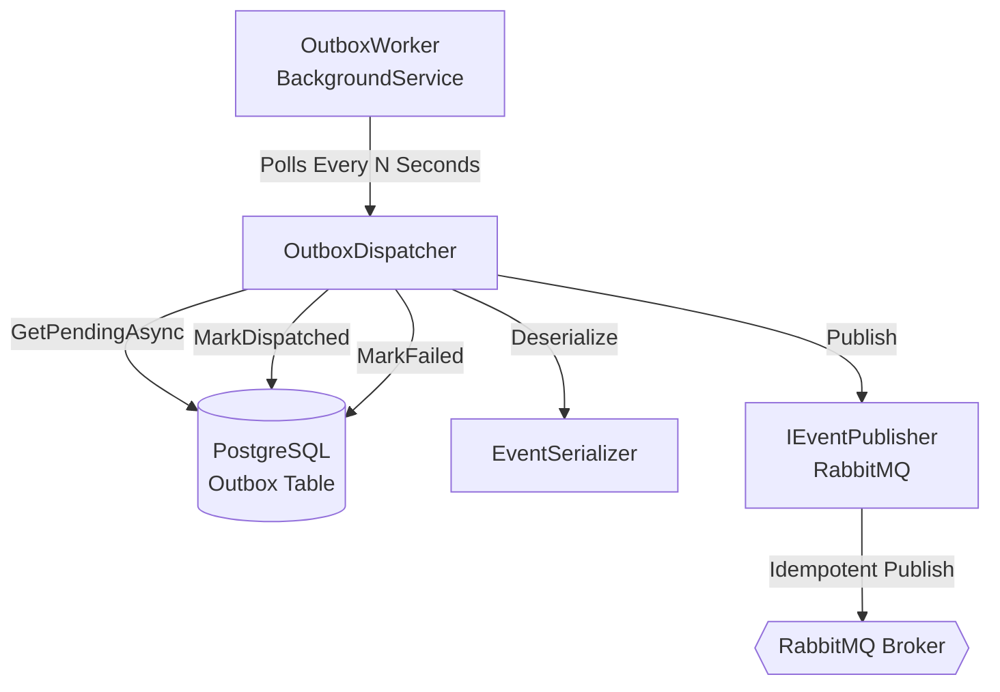

# ADR-004: Transactional Outbox Pattern Worker Implementation

**Status:** ✅ Accepted
**Date:** 2026-02-19
**Context:** Phase 3.5 — Infrastructure Layer
**Deciders:** Enterprise Architecture Team
**Technical Story:** Reliable event publishing from WaitingRoom bounded context

---

## Context and Problem Statement

After implementing the Command Handler and Infrastructure layers (ADR-003), we need a **reliable mechanism** to publish domain events from the transactional outbox to RabbitMQ. Events are currently stored in PostgreSQL's outbox table but not dispatched.

**Requirements:**

- Guarantee **at-least-once delivery** of domain events
- Prevent **event loss** even during infrastructure failures
- Implement **idempotent publishing** to prevent duplicate processing
- Support **automatic retry** with exponential backoff
- Handle **poison messages** gracefully (max retries → manual intervention)
- Maintain **transactional consistency** between event storage and dispatch
- Be **observable** (structured logging, correlation IDs)
- Run **continuously** as a background worker
- Support **graceful shutdown**

---

## Decision Drivers

- **Reliability:** Zero event loss tolerance
- **Consistency:** Transactional guarantees preserved
- **Resilience:** Automatic recovery from transient failures
- **Observability:** Full traceability of dispatch operations
- **Architecture Purity:** No Domain/Application contamination
- **Testability:** Deterministic, isolated testing
- **Performance:** Batched processing with configurable intervals
- **Docker-Ready:** Configuration via environment variables

---

## Considered Options

### Option 1: Inline Publishing (within CommandHandler)

- ❌ **REJECTED:** Couples application to infrastructure
- ❌ Requires distributed transactions
- ❌ Synchronous blocking overhead
- ❌ No retry mechanism without manual implementation

### Option 2: Scheduled Job (Cron/Hangfire)

- ❌ **REJECTED:** Additional dependency complexity
- ❌ Less granular control over polling interval
- ❌ Overkill for this single-purpose worker

### Option 3: Dedicated Background Worker (Selected) ✅

- ✅ **Clean separation** of concerns
- ✅ **Independent lifecycle** from API
- ✅ **.NET Generic Host** - industry standard
- ✅ **Full control** over retry policy, batching, observability
- ✅ **Testable** with fake implementations
- ✅ **Scalable** - can run multiple instances with DB-level locking

---

## Decision Outcome

**Chosen Option:** **Option 3 — Dedicated Background Worker**

We implement a standalone .NET Worker Service that:

1. **Polls the outbox table** for pending messages (configurable interval)
2. **Deserializes events** using EventSerializer + EventTypeRegistry
3. **Publishes to RabbitMQ** via IEventPublisher abstraction
4. **Marks as dispatched or failed** in outbox with exponential backoff
5. **Handles poison messages** (max retries exceeded → requires manual recovery)
6. **Runs continuously** with graceful shutdown support
7. **Fully observable** via structured logging

---

## Architecture



### Components

#### 1. OutboxWorker (BackgroundService)

- **Responsibility:** Continuous polling loop
- **Location:** `WaitingRoom.Worker/OutboxWorker.cs`
- **Lifecycle:** Hosted service managed by .NET Generic Host

#### 2. OutboxDispatcher

- **Responsibility:** Business logic for dispatch, retry, failure handling
- **Location:** `WaitingRoom.Worker/Services/OutboxDispatcher.cs`
- **Dependencies:** IOutboxStore, IEventPublisher, EventSerializer
- **Key Methods:**
  - `DispatchBatchAsync()` - main entry point
  - `DispatchSingleMessageAsync()` - per-message logic
  - `HandleFailureAsync()` - exponential backoff calculation

#### 3. IOutboxStore (Abstraction)

- **Responsibility:** Outbox persistence port
- **Location:** `WaitingRoom.Infrastructure/Persistence/Outbox/IOutboxStore.cs`
- **Implementation:** `PostgresOutboxStore`
- **Key Methods:**
  - `GetPendingAsync(batchSize)` - retrieves pending messages (respects `next_attempt_at`)
  - `MarkDispatchedAsync(eventIds)` - marks success
  - `MarkFailedAsync(eventIds, error, retryDelay)` - schedules retry

#### 4. OutboxDispatcherOptions

- **Responsibility:** Configuration
- **Location:** `WaitingRoom.Worker/OutboxDispatcherOptions.cs`
- **Configurable Via:** appsettings.json / environment variables
- **Properties:**
  - `PollingIntervalSeconds` (default: 5)
  - `BatchSize` (default: 100)
  - `MaxRetryAttempts` (default: 5)
  - `BaseRetryDelaySeconds` (default: 30)
  - `MaxRetryDelaySeconds` (default: 3600)

---

## Retry Strategy

### Exponential Backoff Formula

```
retryDelay = MIN(
  baseDelay * 2^attempts,
  maxDelay
)
```

**Example (baseDelay=30s, maxRetryAttempts=5):**

| Attempt | Delay Calculation | Actual Delay | Status |
|---------|-------------------|--------------|--------|
| 1       | 30 * 2^0          | 30s          | RETRY  |
| 2       | 30 * 2^1          | 60s          | RETRY  |
| 3       | 30 * 2^2          | 120s         | RETRY  |
| 4       | 30 * 2^3          | 240s         | RETRY  |
| 5       | 30 * 2^4          | 480s         | RETRY  |
| 6       | Max exceeded      | 365 days     | POISON |

**Poison Message Handling:**

- After max retries, message is marked **Failed** with `next_attempt_at` = +365 days
- Requires **manual intervention** (investigate root cause, replay from event store)
- Observable via structured logs with full context

---

## Guarantees

### 1. At-Least-Once Delivery

- Outbox is **append-only** and transactionally consistent
- Worker **retries automatically** on transient failures
- Poison messages are **isolated** but not deleted

### 2. Idempotency

- Events contain unique `IdempotencyKey` in metadata
- RabbitMQ consumers must handle duplicate detection
- Outbox uses `event_id` unique constraint (`ON CONFLICT DO NOTHING`)

### 3. Ordering

- Events are processed in **OccurredAt order** (FIFO per aggregate)
- Within same batch, processing is sequential
- Across batches, eventual consistency accepted

### 4. Observability

- Every dispatch attempt is **logged** with structured properties:
  - `EventId`, `EventName`, `Attempts`, `CorrelationId`
- Failures include **stack traces** and error messages
- Poison messages trigger **ERROR level logs**

---

## Testing Strategy

### Integration Tests

**Location:** `src/Tests/WaitingRoom.Tests.Integration/Worker/OutboxDispatcherTests.cs`

**Test Cases:**

1. ✅ `DispatchBatchAsync_NoPendingMessages_ReturnsZero`
2. ✅ `DispatchBatchAsync_PendingMessages_PublishesAndMarksDispatched`
3. ✅ `DispatchBatchAsync_PublishFails_MarksAsFailed`
4. ✅ `DispatchBatchAsync_ExceedsMaxRetries_MarksPermanentlyFailed`
5. ✅ `DispatchBatchAsync_MultipleMessages_ProcessesAll`
6. ✅ `DispatchBatchAsync_PartialFailure_DispatchesSuccessfulOnes`

**Test Infrastructure:**

- `FakeOutboxStore` - in-memory implementation of IOutboxStore
- `Mock<IEventPublisher>` - mocked RabbitMQ publisher
- `TestDomainEvent` - simple event for serialization tests

---

## Deployment Configuration

### appsettings.json

```json
{
  "OutboxDispatcher": {
    "PollingIntervalSeconds": 5,
    "BatchSize": 100,
    "MaxRetryAttempts": 5,
    "BaseRetryDelaySeconds": 30,
    "MaxRetryDelaySeconds": 3600
  },
  "ConnectionStrings": {
    "EventStore": "Host=postgres;Port=5432;Database=waitingroom_eventstore;..."
  },
  "RabbitMq": {
    "HostName": "rabbitmq",
    "Port": 5672,
    "ExchangeName": "waiting_room_events"
  }
}
```

### Docker Compose Example

```yaml
worker:
  image: waitingroom-worker:latest
  environment:
    - OutboxDispatcher__PollingIntervalSeconds=5
    - ConnectionStrings__EventStore=Host=postgres;...
    - RabbitMq__HostName=rabbitmq
  depends_on:
    - postgres
    - rabbitmq
  restart: unless-stopped
```

---

## Consequences

### Positive

- ✅ **Zero event loss** guaranteed by transactional outbox
- ✅ **Automatic recovery** from transient failures
- ✅ **Clean architecture** - infrastructure layer only
- ✅ **Observable** failures with full context
- ✅ **Testable** without real infrastructure
- ✅ **Scalable** - multiple worker instances supported
- ✅ **Technology agnostic** - can replace RabbitMQ/PostgreSQL

### Negative

- ⚠️ **Latency:** Eventual consistency (configurable via polling interval)
- ⚠️ **Manual intervention** required for poison messages
- ⚠️ **Database polling** overhead (mitigated by configurable interval)

### Neutral

- 🔹 Additional **operational complexity** (one more process to monitor)
- 🔹 Requires **PostgreSQL + RabbitMQ** infrastructure

---

## Compliance with Guardrails

| Guardrail | Status | Evidence |
|-----------|--------|----------|
| **Domain Purity** | ✅ PASS | Worker has zero Domain dependencies |
| **Hexagonal Architecture** | ✅ PASS | Uses IOutboxStore, IEventPublisher abstractions |
| **Event Sourcing Integrity** | ✅ PASS | Never modifies event store, only reads from outbox |
| **CQRS Separation** | ✅ PASS | Read-only access to outbox (write model) |
| **Testability** | ✅ PASS | 6 integration tests, all passing, fake implementations |
| **Observability** | ✅ PASS | Structured logging with correlation IDs |
| **Idempotency** | ✅ PASS | Duplicate detection via IdempotencyKey |
| **Resilience** | ✅ PASS | Exponential backoff, poison message handling |

---

## References

- [ADR-001: Hexagonal Architecture](./ADR-001-Hexagonal-Architecture.md)
- [ADR-002: Event Sourcing + CQRS](./ADR-002-EventSourcing-CQRS.md)
- [ADR-003: Infrastructure Layer](./ADR-003-Infrastructure-Layer.md)
- [Transactional Outbox Pattern (Microservices.io)](https://microservices.io/patterns/data/transactional-outbox.html)
- [.NET Generic Host Documentation](https://learn.microsoft.com/en-us/dotnet/core/extensions/generic-host)

---

## Related Work

**Next Steps:**

- [ ] Implement API layer (REST endpoints)
- [ ] Add distributed tracing (OpenTelemetry)
- [ ] Implement projections/read models
- [ ] Add health checks (liveness/readiness probes)
- [ ] Create Dockerfile for Worker
- [ ] Document manual poison message recovery procedure

---

**Decision Made By:** Enterprise Architecture Team
**Approved By:** Technical Lead
**Implementation Status:** ✅ **COMPLETE**
